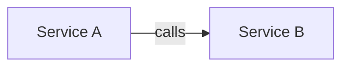
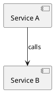

## Table of Contents

- [What it does](#what-it-does)
- [When to use](#when-to-use)
- [How it works](#how-it-works)
- [Minimal example](#minimal-example)
- [Gotchas](#gotchas)
- [Cross-references](#cross-references)


# TECH-export-mermaid-plantuml-d2 — one YAML, four output formats

## What it does

Transforms the canonical YAML graph into one of four output formats:
Mermaid (for docs + GitHub), PlantUML (for technical docs + Wikimedia),
D2 (for modern scriptable diagrams), or ASCII (for terminal output).
The YAML is the source of truth; every format is a derivative.

## When to use

- Mermaid: GitHub-rendered READMEs, Notion docs, Markdown files with
  native Mermaid support
- PlantUML: Confluence / enterprise wikis, large formal specs
- D2: Modern documentation sites that prefer scriptable diagrams with
  layout control
- ASCII: READMEs for old-school audiences, code comments, email

## How it works

Mermaid transform:

```yaml
# YAML input
nodes:
  - id: a
    label: "Service A"
  - id: b
    label: "Service B"
edges:
  - from: a
    to: b
    label: "calls"
    type: sync
```

Becomes:



PlantUML transform:



D2 transform:

```d2
a: Service A
b: Service B
a -> b: calls
```

## Minimal example

```
// Source: diagram-skill-main/REFERENCE.md lines 263-297
# Same YAML produces all three:
nodes:
  - id: client
    label: "Client"
    type: component
  - id: api
    label: "API Gateway"
    type: service
  - id: db
    label: "Users DB"
    type: database

edges:
  - from: client
    to: api
    type: sync
  - from: api
    to: db
    type: sync
```

## Gotchas

- Edge-type taxonomy (`sync / async / return / bidirectional / dependency
  / association`) maps differently to each format — Mermaid has `-->`
  and `-.->` but not a hollow-triangle dependency head, so the mapping
  approximates.
- Node-type visuals (database cylinder, queue ribbon) don't have 1-to-1
  analogs in D2 without custom classes; approximate or use D2's shape
  library.
- Group boundaries render as subgraphs in Mermaid, as rectangles in
  PlantUML, and as containers in D2.

## Cross-references

- [TECH-yaml-canonical-schema](./TECH-yaml-canonical-schema.md)
- [TECH-arrow-vocabulary](./TECH-arrow-vocabulary.md)
- [formats](./formats.md) (existing reference)
- [`../SKILL.md`](../SKILL.md) — parent skill

