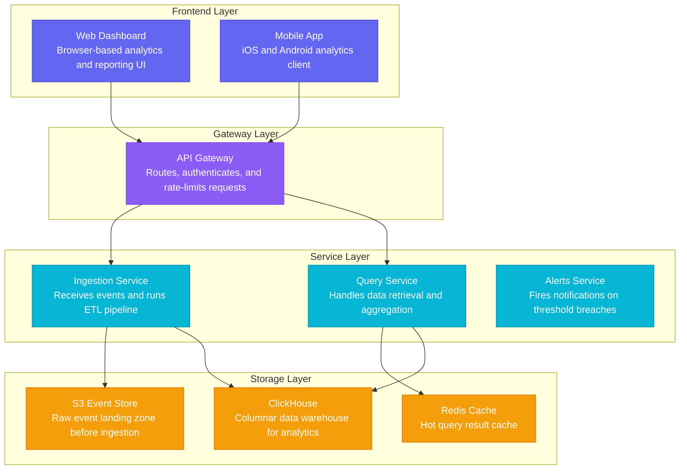

## Table of Contents

- [What it does](#what-it-does)
- [When to use](#when-to-use)
- [How it works](#how-it-works)
- [Minimal example](#minimal-example)
- [Gotchas](#gotchas)
- [Cross-references](#cross-references)


# TECH-mermaid-subgraph-transform

## What it does

Transforms the validated graph JSON into a **Mermaid flowchart** with
layers expressed as `subgraph` blocks and nodes colour-coded via
`classDef` + `class` assignments. One per-layer subgraph, one classDef
per layer, class assignment per node.

## When to use

- **`output_format: "mermaid"`** is the request — this is the
  transform for that format.
- **Downstream documentation** — Mermaid is the right choice when the
  consumer is a Markdown-based doc system (GitHub README, MkDocs,
  Docusaurus) that renders Mermaid natively.

Do not use when the output needs to be self-contained visual (use SVG)
or when the consumer renders the graph JSON directly (Excalidraw canvas
plugin, custom renderer).

## How it works

Five mechanical steps:

1. Open with `flowchart TD` (top-down flow).
2. For each layer (in `order` ascending), emit a `subgraph` block
   containing that layer's nodes:
   ```
   subgraph LAYER_LABEL
     node_id["Node Label\ndescription"]
   end
   ```
3. After all subgraphs, emit edges:
   ```
   source_id --> target_id
   source_id -->|label text| target_id   (if edge has a label)
   ```
4. Emit `classDef` blocks — one per layer, colour from the layer palette.
5. Emit `class` assignments mapping node IDs to their layer's classDef.

## Minimal example

Attributed to `architecture-canvas/references/examples.md`:



## Gotchas

- **Mermaid node IDs must not contain spaces, hyphens, or dots.**
  Snake_case IDs are safe as-is. If a label contains `(`, `)`, `"`, or
  `<`/`>`, wrap/escape appropriately inside `["…"]`:
  - `"` → `&quot;` or switch to `'`
  - `(` / `)` in subgraph names → replace with `[` / `]`
- **Description on a second line via `\n`.** Inside `["Label\ndescription"]`,
  the literal `\n` is the Mermaid newline marker. Real newlines break
  parsing.
- **ClassDef layer index tracks layer ORDER, not the palette hex.** If a
  graph uses only layers at semantic positions 1, 2, 4, re-number them
  to `layer0, layer1, layer2` in the Mermaid output; keep the
  palette hexes mapped to the semantic positions.
- **Trigger a full re-generation** if more than two of the Stage 2 checks
  fail simultaneously (see [validation](validation.md) §mermaid). Patching multiple
  issues is error-prone; re-generating from the validated graph is
  cheap.

## Cross-references

- [formats](formats.md) — full transform spec
  > Format 1: `graph` (default) · Schema · Constraints · Format 2: `mermaid` · Transform Rules · Layer Color Mapping · Mermaid Output Template · Mermaid ID Safety · Format 3: `svg` · Layout Algorithm · SVG Structure · SVG Height Calculation · Format 4: `png`
- [validation](validation.md) — Stage 2 Mermaid checks
  > Stage 1 — Graph Validation (all formats) · 1 Layer count · 2 Node count · 3 Layer balance · 4 Node label quality · 5 Edge integrity · 6 ID integrity · 7 Layer order sequence · Stage 2 — Format Validation · Format: `graph` · Format: `mermaid` · Format: `svg` · Format: `png` · Validation Summary (quick reference) · **Stage 1 — Graph validation**: structural checks on the graph JSON. · **Stage 2 — Format validation**: surface-level checks on the rendered output.
- [TECH-graph-json-schema](TECH-graph-json-schema.md) — source schema
  > What it does · When to use · How it works · Constraints · Minimal example · Gotchas · Cross-references
- [TECH-layer-palette-5-colors](TECH-layer-palette-5-colors.md) — palette used in classDefs
  > What it does · When to use · How it works · Minimal example · Gotchas · Cross-references
- [TECH-svg-layered-layout](TECH-svg-layered-layout.md) — sibling transform for the SVG format
  > What it does · When to use · How it works · Canvas constants · Algorithm · Height calculation · Node card structure · Layer band structure · Minimal example · Gotchas · Cross-references
- [[SKILL](../SKILL.md)](../SKILL.md) — parent skill

