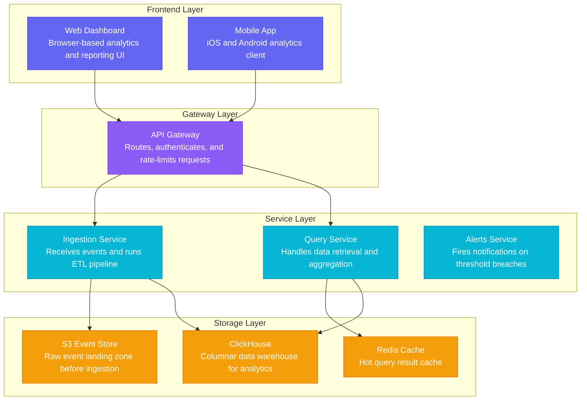

## Table of Contents

- [Input](#input)
- [Design Decisions](#design-decisions)
- [Output 1: `graph`](#output-1-graph)
- [Output 2: `mermaid`](#output-2-mermaid)
- [Output 3: `svg`](#output-3-svg)
- [Output 4: `png`](#output-4-png)

# Architecture Canvas — Multi-Format Examples

One system description, four output formats.

---

## Input

```
We're building a SaaS analytics platform. Users access it through a web
dashboard and a mobile app. Requests go through an API Gateway. The backend
has three core services: an Ingestion Service that receives events, a Query
Service that handles data retrieval, and an Alerts Service that fires
notifications when thresholds are crossed. All services read/write to a
ClickHouse data warehouse. We cache hot queries in Redis. Raw events land
in S3 before ingestion. A background Pipeline Worker handles ETL jobs.
```

## Design Decisions

- **4 layers**: Frontend / Gateway / Services / Storage
- **10 nodes**: merged "web + mobile" as two separate frontend nodes; kept all
  4 backend services; 3 storage nodes (ClickHouse, Redis, S3)
- **8 edges** (10 × 0.8 = 8): clients→gateway, gateway→ingestion + query,
  ingestion→S3 + clickhouse, query→redis + clickhouse, alerts→clickhouse
- Pipeline Worker merged conceptually into Ingestion Service (ETL is its job)
  to avoid a 5-node service layer

---

## Output 1: `graph`

```json
{
  "title": "SaaS Analytics Platform",
  "subtitle": "Event-driven analytics with real-time querying and alerts",
  "layers": [
    { "id": "frontend",  "label": "Frontend Layer",  "color": "#6366F1", "order": 0 },
    { "id": "gateway",   "label": "Gateway Layer",   "color": "#8B5CF6", "order": 1 },
    { "id": "services",  "label": "Service Layer",   "color": "#06B6D4", "order": 2 },
    { "id": "storage",   "label": "Storage Layer",   "color": "#F59E0B", "order": 3 }
  ],
  "nodes": [
    { "id": "web_app",      "label": "Web Dashboard",     "description": "Browser-based analytics and reporting UI",    "layerId": "frontend" },
    { "id": "mobile_app",   "label": "Mobile App",        "description": "iOS and Android analytics client",            "layerId": "frontend" },
    { "id": "api_gateway",  "label": "API Gateway",       "description": "Routes, authenticates, and rate-limits requests", "layerId": "gateway" },
    { "id": "ingest_svc",   "label": "Ingestion Service", "description": "Receives events and runs ETL pipeline",       "layerId": "services" },
    { "id": "query_svc",    "label": "Query Service",     "description": "Handles data retrieval and aggregation",      "layerId": "services" },
    { "id": "alerts_svc",   "label": "Alerts Service",    "description": "Fires notifications on threshold breaches",   "layerId": "services" },
    { "id": "clickhouse",   "label": "ClickHouse",        "description": "Columnar data warehouse for analytics",       "layerId": "storage" },
    { "id": "redis",        "label": "Redis Cache",       "description": "Hot query result cache",                      "layerId": "storage" },
    { "id": "s3",           "label": "S3 Event Store",    "description": "Raw event landing zone before ingestion",     "layerId": "storage" }
  ],
  "edges": [
    { "id": "e1", "source": "web_app",     "target": "api_gateway", "label": "" },
    { "id": "e2", "source": "mobile_app",  "target": "api_gateway", "label": "" },
    { "id": "e3", "source": "api_gateway", "target": "ingest_svc",  "label": "" },
    { "id": "e4", "source": "api_gateway", "target": "query_svc",   "label": "" },
    { "id": "e5", "source": "ingest_svc",  "target": "s3",          "label": "" },
    { "id": "e6", "source": "ingest_svc",  "target": "clickhouse",  "label": "" },
    { "id": "e7", "source": "query_svc",   "target": "redis",       "label": "" },
    { "id": "e8", "source": "query_svc",   "target": "clickhouse",  "label": "" }
  ]
}
```

---

## Output 2: `mermaid`



---

## Output 3: `svg`

```svg
<svg xmlns="http://www.w3.org/2000/svg" width="820" height="620"
     font-family="system-ui, -apple-system, sans-serif">
  <defs>
    <pattern id="grid" width="24" height="24" patternUnits="userSpaceOnUse">
      <path d="M 24 0 L 0 0 0 24" fill="none" stroke="#D8DBE2" stroke-width="0.6"/>
    </pattern>
    <marker id="arrow" markerWidth="9" markerHeight="9"
            refX="8" refY="4.5" orient="auto" markerUnits="userSpaceOnUse">
      <path d="M 0 0 L 9 4.5 L 0 9 L 2.7 4.5 Z" fill="#C7CBD4"/>
    </marker>
  </defs>

  <!-- Background -->
  <rect width="820" height="620" fill="#ECEEF2"/>
  <rect width="820" height="620" fill="url(#grid)"/>

  <!-- ── LAYER 0: Frontend Layer (y=40) ── -->
  <rect x="40" y="40" width="740" height="120" rx="12"
        fill="rgba(255,255,255,0.5)" stroke="#6366F1" stroke-width="1" stroke-opacity="0.2"/>
  <rect x="40" y="52" width="3" height="96" rx="1.5" fill="#6366F1" opacity="0.7"/>
  <rect x="52" y="50" width="102" height="18" rx="9" fill="#6366F1" opacity="0.15"/>
  <text x="60" y="63" font-size="10" font-weight="700" fill="#6366F1"
        letter-spacing="1">FRONTEND LAYER</text>

  <!-- Node: Web Dashboard (x=204, y=68) -->
  <rect x="206" y="72" width="160" height="64" rx="10" fill="black" opacity="0.04"/>
  <rect x="204" y="68" width="160" height="64" rx="10" fill="white" stroke="#E4E7ED" stroke-width="1"/>
  <rect x="204" y="68" width="160" height="3" rx="1.5" fill="#6366F1" opacity="0.8"/>
  <text x="216" y="90" font-size="13" font-weight="600" fill="#111318">Web Dashboard</text>
  <text x="216" y="108" font-size="10.5" fill="#6B7280">Browser analytics and reporting UI</text>
  <circle cx="352" cy="120" r="3.5" fill="#6366F1" opacity="0.55"/>

  <!-- Node: Mobile App (x=456, y=68) -->
  <rect x="458" y="72" width="160" height="64" rx="10" fill="black" opacity="0.04"/>
  <rect x="456" y="68" width="160" height="64" rx="10" fill="white" stroke="#E4E7ED" stroke-width="1"/>
  <rect x="456" y="68" width="160" height="3" rx="1.5" fill="#6366F1" opacity="0.8"/>
  <text x="468" y="90" font-size="13" font-weight="600" fill="#111318">Mobile App</text>
  <text x="468" y="108" font-size="10.5" fill="#6B7280">iOS and Android analytics client</text>
  <circle cx="604" cy="120" r="3.5" fill="#6366F1" opacity="0.55"/>

  <!-- ── LAYER 1: Gateway Layer (y=180) ── -->
  <rect x="40" y="180" width="740" height="120" rx="12"
        fill="rgba(255,255,255,0.5)" stroke="#8B5CF6" stroke-width="1" stroke-opacity="0.2"/>
  <rect x="40" y="192" width="3" height="96" rx="1.5" fill="#8B5CF6" opacity="0.7"/>
  <rect x="52" y="190" width="99" height="18" rx="9" fill="#8B5CF6" opacity="0.15"/>
  <text x="60" y="203" font-size="10" font-weight="700" fill="#8B5CF6"
        letter-spacing="1">GATEWAY LAYER</text>

  <!-- Node: API Gateway (centered, x=330) -->
  <rect x="332" y="212" width="160" height="64" rx="10" fill="black" opacity="0.04"/>
  <rect x="330" y="208" width="160" height="64" rx="10" fill="white" stroke="#E4E7ED" stroke-width="1"/>
  <rect x="330" y="208" width="160" height="3" rx="1.5" fill="#8B5CF6" opacity="0.8"/>
  <text x="342" y="230" font-size="13" font-weight="600" fill="#111318">API Gateway</text>
  <text x="342" y="248" font-size="10.5" fill="#6B7280">Routes and authenticates requests</text>
  <circle cx="478" cy="260" r="3.5" fill="#8B5CF6" opacity="0.55"/>

  <!-- ── LAYER 2: Service Layer (y=320) ── -->
  <rect x="40" y="320" width="740" height="120" rx="12"
        fill="rgba(255,255,255,0.5)" stroke="#06B6D4" stroke-width="1" stroke-opacity="0.2"/>
  <rect x="40" y="332" width="3" height="96" rx="1.5" fill="#06B6D4" opacity="0.7"/>
  <rect x="52" y="330" width="95" height="18" rx="9" fill="#06B6D4" opacity="0.15"/>
  <text x="60" y="343" font-size="10" font-weight="700" fill="#06B6D4"
        letter-spacing="1">SERVICE LAYER</text>

  <!-- Node: Ingestion Service (x=100) -->
  <rect x="102" y="352" width="160" height="64" rx="10" fill="black" opacity="0.04"/>
  <rect x="100" y="348" width="160" height="64" rx="10" fill="white" stroke="#E4E7ED" stroke-width="1"/>
  <rect x="100" y="348" width="160" height="3" rx="1.5" fill="#06B6D4" opacity="0.8"/>
  <text x="112" y="370" font-size="13" font-weight="600" fill="#111318">Ingestion Service</text>
  <text x="112" y="388" font-size="10.5" fill="#6B7280">Receives events and ETL pipeline</text>
  <circle cx="248" cy="400" r="3.5" fill="#06B6D4" opacity="0.55"/>

  <!-- Node: Query Service (x=330) -->
  <rect x="332" y="352" width="160" height="64" rx="10" fill="black" opacity="0.04"/>
  <rect x="330" y="348" width="160" height="64" rx="10" fill="white" stroke="#E4E7ED" stroke-width="1"/>
  <rect x="330" y="348" width="160" height="3" rx="1.5" fill="#06B6D4" opacity="0.8"/>
  <text x="342" y="370" font-size="13" font-weight="600" fill="#111318">Query Service</text>
  <text x="342" y="388" font-size="10.5" fill="#6B7280">Handles data retrieval and aggregation</text>
  <circle cx="478" cy="400" r="3.5" fill="#06B6D4" opacity="0.55"/>

  <!-- Node: Alerts Service (x=560) -->
  <rect x="562" y="352" width="160" height="64" rx="10" fill="black" opacity="0.04"/>
  <rect x="560" y="348" width="160" height="64" rx="10" fill="white" stroke="#E4E7ED" stroke-width="1"/>
  <rect x="560" y="348" width="160" height="3" rx="1.5" fill="#06B6D4" opacity="0.8"/>
  <text x="572" y="370" font-size="13" font-weight="600" fill="#111318">Alerts Service</text>
  <text x="572" y="388" font-size="10.5" fill="#6B7280">Fires notifications on threshold breaches</text>
  <circle cx="708" cy="400" r="3.5" fill="#06B6D4" opacity="0.55"/>

  <!-- ── LAYER 3: Storage Layer (y=460) ── -->
  <rect x="40" y="460" width="740" height="120" rx="12"
        fill="rgba(255,255,255,0.5)" stroke="#F59E0B" stroke-width="1" stroke-opacity="0.2"/>
  <rect x="40" y="472" width="3" height="96" rx="1.5" fill="#F59E0B" opacity="0.7"/>
  <rect x="52" y="470" width="95" height="18" rx="9" fill="#F59E0B" opacity="0.15"/>
  <text x="60" y="483" font-size="10" font-weight="700" fill="#F59E0B"
        letter-spacing="1">STORAGE LAYER</text>

  <!-- Node: ClickHouse (x=100) -->
  <rect x="102" y="492" width="160" height="64" rx="10" fill="black" opacity="0.04"/>
  <rect x="100" y="488" width="160" height="64" rx="10" fill="white" stroke="#E4E7ED" stroke-width="1"/>
  <rect x="100" y="488" width="160" height="3" rx="1.5" fill="#F59E0B" opacity="0.8"/>
  <text x="112" y="510" font-size="13" font-weight="600" fill="#111318">ClickHouse</text>
  <text x="112" y="528" font-size="10.5" fill="#6B7280">Columnar warehouse for analytics</text>
  <circle cx="248" cy="540" r="3.5" fill="#F59E0B" opacity="0.55"/>

  <!-- Node: Redis Cache (x=330) -->
  <rect x="332" y="492" width="160" height="64" rx="10" fill="black" opacity="0.04"/>
  <rect x="330" y="488" width="160" height="64" rx="10" fill="white" stroke="#E4E7ED" stroke-width="1"/>
  <rect x="330" y="488" width="160" height="3" rx="1.5" fill="#F59E0B" opacity="0.8"/>
  <text x="342" y="510" font-size="13" font-weight="600" fill="#111318">Redis Cache</text>
  <text x="342" y="528" font-size="10.5" fill="#6B7280">Hot query result cache</text>
  <circle cx="478" cy="540" r="3.5" fill="#F59E0B" opacity="0.55"/>

  <!-- Node: S3 Event Store (x=560) -->
  <rect x="562" y="492" width="160" height="64" rx="10" fill="black" opacity="0.04"/>
  <rect x="560" y="488" width="160" height="64" rx="10" fill="white" stroke="#E4E7ED" stroke-width="1"/>
  <rect x="560" y="488" width="160" height="3" rx="1.5" fill="#F59E0B" opacity="0.8"/>
  <text x="572" y="510" font-size="13" font-weight="600" fill="#111318">S3 Event Store</text>
  <text x="572" y="528" font-size="10.5" fill="#6B7280">Raw event landing zone</text>
  <circle cx="708" cy="540" r="3.5" fill="#F59E0B" opacity="0.55"/>

  <!-- ── EDGES ── -->
  <!-- web_app → api_gateway -->
  <path d="M 284 132 C 284 158 410 182 410 208"
        fill="none" stroke="#C7CBD4" stroke-width="1.5" marker-end="url(#arrow)" opacity="0.6"/>
  <!-- mobile_app → api_gateway -->
  <path d="M 536 132 C 536 158 460 182 460 208"
        fill="none" stroke="#C7CBD4" stroke-width="1.5" marker-end="url(#arrow)" opacity="0.6"/>
  <!-- api_gateway → ingest_svc -->
  <path d="M 390 272 C 390 300 180 322 180 348"
        fill="none" stroke="#C7CBD4" stroke-width="1.5" marker-end="url(#arrow)" opacity="0.6"/>
  <!-- api_gateway → query_svc -->
  <path d="M 440 272 C 440 300 410 322 410 348"
        fill="none" stroke="#C7CBD4" stroke-width="1.5" marker-end="url(#arrow)" opacity="0.6"/>
  <!-- ingest_svc → s3 -->
  <path d="M 180 412 C 180 440 640 462 640 488"
        fill="none" stroke="#C7CBD4" stroke-width="1.5" marker-end="url(#arrow)" opacity="0.6"/>
  <!-- ingest_svc → clickhouse -->
  <path d="M 180 412 C 180 450 180 468 180 488"
        fill="none" stroke="#C7CBD4" stroke-width="1.5" marker-end="url(#arrow)" opacity="0.6"/>
  <!-- query_svc → redis -->
  <path d="M 410 412 C 410 450 410 468 410 488"
        fill="none" stroke="#C7CBD4" stroke-width="1.5" marker-end="url(#arrow)" opacity="0.6"/>
  <!-- query_svc → clickhouse -->
  <path d="M 390 412 C 390 440 210 462 210 488"
        fill="none" stroke="#C7CBD4" stroke-width="1.5" marker-end="url(#arrow)" opacity="0.6"/>

  <!-- ── TITLE ── -->
  <text x="410" y="604" text-anchor="middle" font-size="12" font-weight="600"
        fill="#6B7280">SaaS Analytics Platform</text>
</svg>
```

---

## Output 4: `png`

*(Same SVG as Output 3, plus export instructions)*

```
---
To save as PNG:
1. Copy the SVG above into a file named architecture.svg
2. Open it in any browser — it renders immediately
3. Right-click the image → "Save image as…" → choose PNG
   OR use the browser's print dialog → Save as PDF, then convert

For programmatic conversion:
  • Node.js: sharp('architecture.svg').png().toFile('architecture.png')
  • Python:  cairosvg.svg2png(url='architecture.svg', write_to='architecture.png')
  • CLI:     inkscape architecture.svg --export-png=architecture.png
  • Online:  https://svgtopng.com
```
