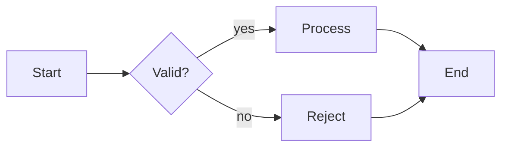

# Mermaid — canonical format reference

This file is the single authoritative spec for Mermaid within the `ai-maestro-webdesign` plugin. Every skill that creates, modifies, validates, or converts Mermaid pulls from this file. Supported grammars, themes, `mmdc` CLI flags, output paths (SVG / PNG / ASCII), validation, and the technique catalog are all below.

**Consumers (cross-references):**
- `../../amw-mermaid-render/SKILL.md` — the ONLY Mermaid renderer in the plugin
- `../../amw-diagram-architecture/SKILL.md` — emits Mermaid source text
- `../../amw-ux-flows/SKILL.md` — PRD → Mermaid wireframes
- `../../external/mermaid-render/` — vendored beautiful-mermaid backend
- `../../bin/amw-mermaid-render.sh` — shell wrapper (SVG / PNG / ASCII)
- `../../bin/amw-mermaid-lint.sh` (planned; Task 0c) — validator wrapper (`mmdc` dry-run)
- `../../bin/amw-validate-ascii.py` — warn-only gate on ASCII rendering
- `./ir-schema.md` — when Mermaid is a source of the diagram IR
- `./conversion-matrix.md` — Mermaid → {ASCII, HTML, SVG, PNG} cells
- `./validation-dispatcher.md` — Mermaid validator branch

---

## 1. Format definition

Mermaid is a **plain-text diagram grammar** — Markdown-friendly, rendered to SVG/PNG/ASCII by `mmdc` (mermaid-cli) or the vendored `beautiful-mermaid` backend.

### 1.1 File conventions

- **Extensions**: `.mmd` or `.mermaid` (preferred). Also accepted inside code fences (```` ```mermaid ```` ... ```` ``` ```` ) in Markdown files.
- **Detection**: first line starts with one of `flowchart | graph | sequenceDiagram | stateDiagram | stateDiagram-v2 | classDiagram | erDiagram | gantt | pie | journey | mindmap | quadrantChart | gitGraph | C4Context`.

### 1.2 Minimal example



---

## 2. Supported grammars

The plugin supports the full Mermaid grammar, but these 9 types are officially documented + template-backed via `external/mermaid-render/examples/`:

| Type | Header | Use case |
|---|---|---|
| Flowchart | `flowchart TD` / `flowchart LR` / `flowchart BT` / `flowchart RL` or `graph ...` | Control flow, process, decisions |
| Sequence | `sequenceDiagram` | Request/response, handshakes, timing |
| State | `stateDiagram-v2` | State machines, lifecycle |
| Class | `classDiagram` | UML class relationships |
| ER | `erDiagram` | Database relationships |
| Gantt | `gantt` | Project timelines |
| Pie | `pie` | Simple percentage breakdowns |
| Journey | `journey` | User journey maps |
| Mindmap | `mindmap` | Ideation trees |

Direction suffixes for flowchart/graph:
- `TD` / `TB` = top-down
- `BT` = bottom-up
- `LR` = left-right (default recommendation for wide viewports)
- `RL` = right-left

### 2.1 Node shapes (flowchart)

| Syntax | Shape | Semantic |
|---|---|---|
| `A[Text]` | Rectangle | Process |
| `A(Text)` | Rounded rectangle | Softer process |
| `A([Text])` | Stadium | Start / end |
| `A[[Text]]` | Subroutine | Nested process |
| `A[(Text)]` | Cylinder | Database |
| `A((Text))` | Circle | State / terminal |
| `A{Text}` | Diamond | Decision |
| `A{{Text}}` | Hexagon | Pre-condition |
| `A[/Text/]` | Parallelogram | Input / output |
| `A[\Text\]` | Reverse parallelogram | Manual input |

### 2.2 Edges (flowchart)

| Syntax | Meaning |
|---|---|
| `A --> B` | Solid arrow (sync) |
| `A -.-> B` | Dotted arrow (async) |
| `A ==> B` | Thick arrow (emphasis) |
| `A --"label"--> B` | Labelled arrow |
| `A -->|label| B` | Labelled arrow (alt syntax) |
| `A --- B` | Line without arrow |

---

## 3. Themes

### 3.1 Built-in themes (15)

Shipped with the `beautiful-mermaid` backend (docs: `external/mermaid-render/README.md`). All also accessible via `bin/amw-mermaid-render.sh --list-themes`.

**Light** (6): `zinc-light`, `github-light`, `solarized-light`, `nord-light`, `catppuccin-latte`, `tokyo-night-light`

**Dark** (9): `zinc-dark`, `tokyo-night`, `tokyo-night-storm`, `catppuccin-mocha`, `nord`, `dracula`, `github-dark`, `solarized-dark`, `one-dark`

### 3.2 Theme-selection guide

| Context | Recommended |
|---|---|
| Dark documentation (MDX / Markdown) | `tokyo-night` (default), `github-dark` |
| Light documentation | `github-light`, `zinc-light` |
| Vibrant / high-contrast | `dracula` |
| Print-friendly | `zinc-light`, `solarized-light` |
| High-contrast presentations | `zinc-light` (light), `zinc-dark` (dark) |
| Terminal screenshots | `tokyo-night`, `dracula` |
| Warm tone | `catppuccin-latte` / `catppuccin-mocha` |
| Brand-matching (not in list) | Use 2-color Mono Mode (`--bg` + `--fg`) |

### 3.3 Mono Mode (2-color derivation)

When only `--bg` + `--fg` supplied, the backend derives all other tokens via CSS `color-mix(in srgb, ...)`:

| Element | Blend |
|---|---|
| Text (primary) | `--fg` at 100% |
| Text (secondary) | `--fg` 60% into `--bg` |
| Edge labels | `--fg` 40% into `--bg` |
| Connectors | `--fg` 30% into `--bg` |
| Arrow heads | `--fg` 50% into `--bg` |
| Node fill | `--fg` 3% into `--bg` |
| Node stroke | `--fg` 20% into `--bg` |

### 3.4 7-color enriched palette

For finer brand control: override `--line`, `--accent`, `--muted`, `--surface`, `--border` individually.

### 3.5 Live theme-switching (browser)

SVG output exposes theme as CSS custom properties on the root `<svg>`; host page flips themes at runtime *without re-rendering*:

```javascript
const svg = document.querySelector('svg');
svg.style.setProperty('--bg', '#1a1b26');
svg.style.setProperty('--fg', '#a9b1d6');
```

---

## 4. mmdc CLI flags (17 total)

All flags documented in `../../skills/amw-mermaid-render/SKILL.md`. Forwarded verbatim by `../../bin/amw-mermaid-render.sh`:

| Flag | Default | Purpose |
|---|---|---|
| `--input <file>` / `-i <file>` | required | Input `.mmd` file; `-` for stdin |
| `--out <file>` / `--output` / `-o` | stdout | Output file path |
| `--format <fmt>` / `-f <fmt>` | `svg` | `svg` or `ascii` |
| `--theme <name>` / `-t <name>` | Mono Mode | One of 15 built-in themes |
| `--bg <hex>` | `#FFFFFF` | Background (Mono Mode) |
| `--fg <hex>` | `#27272A` | Foreground (Mono Mode) |
| `--line <hex>` | derived | Edge / connector color |
| `--accent <hex>` | derived | Arrow-head and highlight color |
| `--muted <hex>` | derived | Secondary text / label color |
| `--surface <hex>` | derived | Node fill-tint color |
| `--border <hex>` | derived | Node stroke color |
| `--font <name>` | `Inter` | Font family for SVG labels |
| `--transparent` | off | Transparent background (SVG only) |
| `--use-ascii` | off | Pure ASCII (`+ - |`) instead of Unicode box-drawing |
| `--padding-x <n>` | `5` | Horizontal node spacing (ASCII) |
| `--padding-y <n>` | `5` | Vertical node spacing (ASCII) |
| `--box-border-padding <n>` | `1` | Padding inside node boxes (ASCII) |

---

## 5. Output paths

### 5.1 Mermaid → SVG (default, high fidelity)

```bash
bin/amw-mermaid-render.sh --input diagram.mmd --format svg \
  --theme tokyo-night --out diagram.svg
```

- Mostly self-contained. Single external reference: `@import url('https://fonts.googleapis.com/...Inter...')` inside the SVG `<style>` block. Strip that line for CSP-locked deployment; the SVG falls back to `system-ui` fonts.
- No external scripts, no external CSS links, no CDN-hosted images aside from that single font import.

### 5.2 Mermaid → PNG (via `mmdc -t png`)

Direct rasterization:

```bash
mmdc -i diagram.mmd -o diagram.png -t default
```

Via the plugin's wrapper (preferred because themes apply):

```bash
bin/amw-mermaid-render.sh --input diagram.mmd --format svg --theme tokyo-night --out /tmp/x.svg
python3 -c "import cairosvg; cairosvg.svg2png(url='/tmp/x.svg', write_to='diagram.png')"
```

See `./png.md` for the SVG → PNG chain.

### 5.3 Mermaid → ASCII (Unicode default)

```bash
echo 'graph LR; A --> B --> C' | \
  bin/amw-mermaid-render.sh --input - --format ascii
```

Default = Unicode box-drawing (`│─┼└┘┐┌┤├` etc).

### 5.4 Mermaid → pure ASCII (README-safe)

```bash
cat architecture.mmd | \
  bin/amw-mermaid-render.sh --input - --format ascii --use-ascii --out architecture.txt
```

`--use-ascii` restricts to `+ - | > <`. Passes through `../../bin/amw-validate-ascii.py` as **warn-only** (variable-width labels may trigger alignment warnings — fix is to shorten labels, not edit output).

### 5.5 Batch rendering (parallel)

```bash
node external/mermaid-render/scripts/batch.mjs \
  --input-dir ./diagrams --output-dir ./rendered \
  --format svg --theme tokyo-night --workers 4
```

Default `--workers 4`. Bump to 8 for 10+ diagrams on multi-core laptops. Upper bound = CPU core count.

---

## 6. Validation

### 6.1 Dry-run linting

`bin/amw-mermaid-lint.sh` (planned; Task 0c) wraps:

```bash
mmdc -i diagram.mmd -o /tmp/_mermaid_lint.svg 2>&1
# Exit 0 = valid; exit !=0 + stderr = parse error
```

Output contract per `./validation-dispatcher.md`: `PASS|FAIL: line: message [FIX: hint]`.

### 6.2 Common validation failures

| Error | Likely cause | Fix hint |
|---|---|---|
| `Parse error on line N` | Syntax typo in node/edge | Check the line at `https://mermaid.live` |
| `Expecting ...` | Unclosed bracket or missing `-->` | Count brackets |
| `Unknown theme` | Theme typo | Run `bin/amw-mermaid-render.sh --list-themes` |
| Empty SVG output | Invalid syntax | Test at `https://mermaid.live` |

---

## 7. Per-source breakdown of the technique catalog

| Src | Source material | TECH range | Focus |
|---|---|---|---|
| S1 | `SKILLS-TO-INTEGRATE/diagrams-skills/beautiful-mermaid-main.zip` + `external/mermaid-render/` | TECH-MM-01 .. TECH-MM-12 | Themes, Mono Mode, 7-color palette, Shiki integration, live theme-switching |
| S2 | `SKILLS-TO-INTEGRATE/diagrams-skills/Pretty-mermaid-skills-main.zip` + `skills/amw-mermaid-render/SKILL.md` | TECH-MM-13 .. TECH-MM-22 | CLI flags, batch rendering, stdin fallback, ASCII output, warn-only alignment gate |
| S3 | Flowchart / sequence / state grammar docs | TECH-MM-23 .. TECH-MM-31 | Node shapes, edge syntax, subgraphs, direction suffix |
| S4 | `SKILLS-TO-INTEGRATE/diagrams-skills/agent-skill-diagramming-flows-main.zip` | TECH-MM-32 .. TECH-MM-37 | Newlines > semicolons, labels, auto-routing, multi-statement input |
| S5 | `bin/amw-mermaid-render.sh` wrapper | TECH-MM-38 .. TECH-MM-40 | Auto-install fallback, exit codes, stdin auto-detection |

Total: **40 techniques**, 5 sources.

---

## 8. Technique catalog

Format: `TECH-MM-NN <name>: <description> | source: <path>:<section> | applies-to: <use-case>`

### S1 — beautiful-mermaid (backend)

TECH-MM-01 theme-15-builtin: 15 built-in themes split 6 light / 9 dark | source: skills/amw-mermaid-render/SKILL.md:98-113 | applies-to: theme selection when brand tokens not supplied
TECH-MM-02 mono-mode-derivation: 2-color (`--bg` + `--fg`) triggers Mono Mode; backend derives all other tokens via `color-mix(in srgb)` with fixed ratios | source: skills/amw-mermaid-render/SKILL.md:139-159 | applies-to: brand-matched themes with only primary + secondary color
TECH-MM-03 seven-color-enriched: caller can override `--line`, `--accent`, `--muted`, `--surface`, `--border` individually; unset derive via Mono Mode | source: skills/amw-mermaid-render/SKILL.md:155-160 | applies-to: fine-grained theming
TECH-MM-04 shiki-integration: `fromShikiTheme(highlighter.getTheme('vitesse-dark'))` imports VS Code theme as Mermaid colors | source: skills/amw-mermaid-render/SKILL.md:164-182 | applies-to: diagrams embedded alongside Shiki-highlighted code
TECH-MM-05 shiki-mapping-table: `editor.background → bg`, `editor.foreground → fg`, `editorLineNumber.foreground → muted`, `focusBorder → accent`, `editorWidget.background → surface`, `editorWidget.border → border` | source: skills/amw-mermaid-render/SKILL.md:185-193 | applies-to: Shiki → Mermaid color mapping
TECH-MM-06 live-theme-switch-css-props: CSS custom properties on root `<svg>` allow host-page runtime theme flip without re-render | source: skills/amw-mermaid-render/SKILL.md:196-226 | applies-to: dark/light toggle on docs sites
TECH-MM-07 font-import-strippable: single `@import url('https://fonts.googleapis.com/...Inter...')` — strip for CSP-locked deployment; `system-ui` fallback auto-applies | source: skills/amw-mermaid-render/SKILL.md:56-66 | applies-to: offline / CSP-strict deployments
TECH-MM-08 transparent-bg: `--transparent` flag for dark/light compatibility SVGs | source: skills/amw-mermaid-render/SKILL.md:69 | applies-to: SVGs embedded in both light and dark hosts
TECH-MM-09 theme-per-context-map: dark docs → tokyo-night; light docs → zinc-light; vibrant → dracula; print → zinc-light; terminal → tokyo-night | source: skills/amw-mermaid-render/SKILL.md:125-137 | applies-to: default-theme selection by deployment target
TECH-MM-10 css-custom-properties-full-interface: `--bg --fg --line --accent --muted --surface --border` — 7 total | source: skills/amw-mermaid-render/SKILL.md:215-223 | applies-to: theme system contract
TECH-MM-11 color-mix-srgb: derivation uses `color-mix(in srgb, fg ratio%, bg (100-ratio)%)` | source: beautiful-mermaid/references/THEMES.md (derivation formula) | applies-to: Mono Mode internals
TECH-MM-12 self-contained-svg-minus-font: everything else inlined (styles, arrowheads, theme CSS variables); only exception is the Google Fonts import | source: skills/amw-mermaid-render/SKILL.md:56-60 | applies-to: single-file distribution

### S2 — Pretty-mermaid + mermaid-render/SKILL.md (CLI)

TECH-MM-13 cli-flag-surface-17: `--input --out --format --theme --bg --fg --line --accent --muted --surface --border --font --transparent --use-ascii --padding-x --padding-y --box-border-padding` | source: skills/amw-mermaid-render/SKILL.md:249-266 | applies-to: full API surface
TECH-MM-14 stdin-auto-detect: if `--input` omitted AND stdin not a TTY, read from stdin | source: skills/amw-mermaid-render/SKILL.md:270-281 | applies-to: piped rendering workflows
TECH-MM-15 ascii-output-unicode-default: default ASCII mode uses Unicode box-drawing (`│─┼└┘┐┌┤├`) | source: skills/amw-mermaid-render/SKILL.md:82 | applies-to: terminal screenshots
TECH-MM-16 use-ascii-pure: `--use-ascii` restricts to `+ - | > <` for legacy terminals / plain-ASCII pipelines | source: skills/amw-mermaid-render/SKILL.md:84-85 | applies-to: old markdown renderers, legacy tooling
TECH-MM-17 ascii-validator-warn-only: wrapper pipes ASCII through `../../bin/amw-validate-ascii.py` as WARN (not FAIL) — variable-width labels are a known issue | source: skills/amw-mermaid-render/SKILL.md:86-92 | applies-to: ASCII output post-processing
TECH-MM-18 newlines-over-semicolons: multi-statement input uses `\n` separators, not `;` — shells mangle semicolons in `echo` | source: skills/amw-mermaid-render/SKILL.md:283-298 | applies-to: multi-line piped inputs
TECH-MM-19 batch-parallel-workers: `batch.mjs --workers 4` default, bump to 8 for 10+ diagrams; upper bound = CPU core count | source: skills/amw-mermaid-render/SKILL.md:348-367 | applies-to: bulk-render workflows
TECH-MM-20 padding-ascii-tuning: `--padding-x 5 --padding-y 5 --box-border-padding 1` are the ASCII-mode spacing knobs | source: skills/amw-mermaid-render/SKILL.md:264-266 | applies-to: ASCII density tuning
TECH-MM-21 font-override-inter: `--font` defaults to `Inter`; override for brand typography (must be system-available or served by host) | source: skills/amw-mermaid-render/SKILL.md:261 | applies-to: brand-matched SVG output
TECH-MM-22 2-color-custom-palette-arg: explicit `--bg` + `--fg` on command line bypasses named theme | source: skills/amw-mermaid-render/SKILL.md:323-333 | applies-to: brand palettes not in the 15-theme library

### S3 — Mermaid grammar

TECH-MM-23 flowchart-direction-suffix: `TD/TB/LR/BT/RL` on `flowchart` or `graph` header | source: skills/amw-mermaid-render/SKILL.md:371-375 | applies-to: layout direction decision
TECH-MM-24 node-shape-by-bracket: `[]` rect, `()` rounded, `([])` stadium, `[[]]` subroutine, `[()]` cylinder, `(())` circle, `{}` diamond, `{{}}` hexagon, `[/…/]` parallelogram, `[\…\]` reverse parallelogram | source: Mermaid official grammar (agent-skill-diagramming-flows-main) | applies-to: semantic node shape selection
TECH-MM-25 edge-arrow-types: `-->` sync, `-.->` async (dotted), `==>` emphasis (thick), `---` no arrow | source: Mermaid official grammar | applies-to: edge semantics
TECH-MM-26 edge-label-syntax-double: both `A --"label"--> B` and `A -->|label| B` supported; use the latter for compactness | source: Mermaid docs | applies-to: labelled edges
TECH-MM-27 subgraph-grouping: `subgraph Name … end` groups nodes visually with a title | source: Mermaid grammar | applies-to: nested zones, namespaces
TECH-MM-28 sequenceDiagram-arrow-types: `->>` solid, `-->>` dashed, `-x` cross (with-X arrow), `-)` open arrow (with dot tail) | source: Mermaid sequence docs | applies-to: sequenceDiagram participant exchange
TECH-MM-29 stateDiagram-v2-composite: nested state machines via `state Name { … }` inside `stateDiagram-v2` | source: Mermaid stateDiagram docs | applies-to: hierarchical state machines
TECH-MM-30 classDiagram-relations: `<|--` inherits, `--` plain assoc, `*--` composition, `o--` aggregation | source: Mermaid classDiagram docs | applies-to: UML class diagrams
TECH-MM-31 erDiagram-cardinality: `||--o{` = one-to-many; `}o--||` = many-to-one; labels follow `:` | source: Mermaid erDiagram docs | applies-to: relational schema diagrams

### S4 — agent-skill-diagramming-flows

TECH-MM-32 init-config-directive: `%%{init: {"theme":"default","themeVariables":{"primaryColor":"#..."}}}%%` at top of file for inline config | source: Mermaid config | applies-to: brand-specific theming without CLI flags
TECH-MM-33 comment-pct-pct: `%% this is a comment` ignored by the parser | source: Mermaid lexer | applies-to: inline documentation of diagrams
TECH-MM-34 multi-statement-newline: separator `\n` beats `;` (shell-safe) | source: agent-skill-diagramming-flows/SKILL.md:20 | applies-to: programmatic diagram generation
TECH-MM-35 label-quoting-required: labels with spaces / special chars must be quoted: `A["Two Words"]` | source: Mermaid grammar | applies-to: multi-word node labels
TECH-MM-36 auto-routing: layout is auto-computed by dagre engine; edge crossings minimized but not guaranteed | source: Mermaid internals | applies-to: expectation management — caller cannot pin exact positions
TECH-MM-37 style-per-node: `style A fill:#f9f,stroke:#333,stroke-width:2px` syntactic form for per-node styling | source: Mermaid directives | applies-to: emphasis / callouts on specific nodes

### S5 — bin/amw-mermaid-render.sh wrapper

TECH-MM-38 auto-install-fallback: wrapper auto-runs `npm install` on `MODULE_NOT_FOUND`; 120s timeout | source: skills/amw-mermaid-render/SKILL.md:414-426 | applies-to: first-run bootstrap on a fresh clone
TECH-MM-39 exit-code-convention: `0` success; `1` parse error / theme typo; `2` vendored backend missing (run `/amw-init`); `3` node.js missing | source: skills/amw-mermaid-render/SKILL.md:442-448 | applies-to: scripting the wrapper in CI
TECH-MM-40 stdin-pipe-auto: `echo '...' | bin/amw-mermaid-render.sh --format ascii` works without `--input -` (auto-detect) | source: skills/amw-mermaid-render/SKILL.md:275-281 | applies-to: one-liner rendering

---

## 9. Failure modes

| Symptom | Cause | Fix |
|---|---|---|
| `Cannot find module 'beautiful-mermaid'` | auto-install failed | `cd external/mermaid-render && npm install` |
| Empty SVG output | Invalid Mermaid syntax | Test at `https://mermaid.live` |
| Fonts not rendering | Target system lacks declared font | Use `"Inter, system-ui"` stack or add `@font-face` to host |
| CJK/emoji breaking ASCII alignment | Mermaid ASCII renderer doesn't know double-width chars | Rename node labels to plain ASCII |
| `Parse error on line N` | Syntax typo | Test at `https://mermaid.live` |
| Mono Mode tokens too close to bg | `--fg` insufficient contrast | Choose darker `--fg` or use 7-color palette with explicit `--line` / `--border` |

---

## 10. Anti-patterns

- **Switching Mermaid backend to `@mermaid-js/mermaid-cli`** — that ships Puppeteer + Chrome, 50× larger on disk than `beautiful-mermaid`. The plugin is headless on purpose.
- **Inventing new themes inside the plugin** — upstream `beautiful-mermaid` owns the 15-theme library. Use 2-color Mono Mode for custom brands.
- **Running Mermaid ASCII through the HARD validator** — alignment is a best-effort property of the Mermaid renderer. Validator is WARN-only on Mermaid output, FAIL-strict on everything else.
- **Embedding Mermaid source inside HTML `<code>` without rendering** — the plugin always renders to SVG (or ASCII) before delivery. Raw `<code class="language-mermaid">` is not output.
