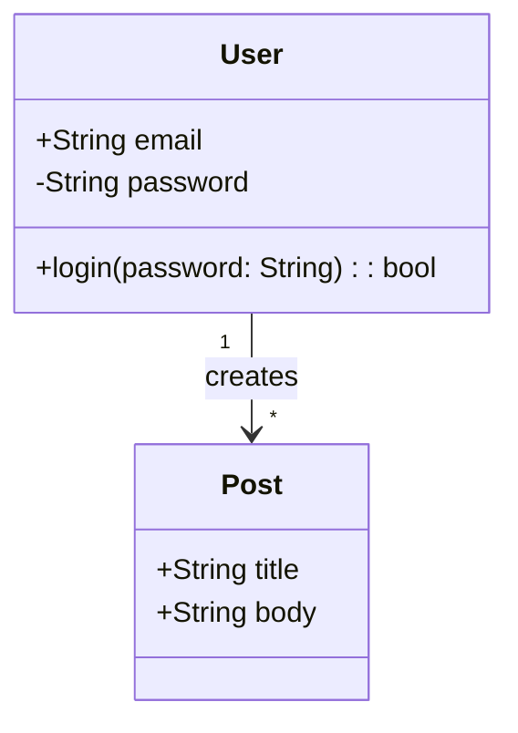

## Table of Contents

- [What it does](#what-it-does)
- [When to use](#when-to-use)
- [Class definition](#class-definition)
- [Visibility markers](#visibility-markers)
- [Relationship arrows (UML)](#relationship-arrows-uml)
- [Cardinality](#cardinality)
- [Abstract / interface / generic](#abstract-interface-generic)
- [Minimal example](#minimal-example)
- [Gotchas](#gotchas)
- [Cross-references](#cross-references)

# Class diagram grammar

## What it does

UML-style class diagrams — classes, attributes, methods, visibility,
relationships (inheritance, composition, aggregation), cardinality,
abstract/interface markers.

## When to use

- Object model documentation for OOP codebases.
- Public API surface — showing consumers what classes exist.
- Domain modeling during design.

## Class definition

```
classDiagram
    class ClassName {
        +String publicField
        -int privateField
        #bool protectedField
        ~String packageField

        +publicMethod()
        -privateMethod()
        #protectedMethod()
        ~packageMethod()
    }
```

## Visibility markers

```
+   Public
-   Private
#   Protected
~   Package / Internal
```

## Relationship arrows (UML)

```
ClassA --|> ClassB     Inheritance        (solid + triangle)
ClassC --* ClassD      Composition        (solid + filled diamond)
ClassE --o ClassF      Aggregation        (solid + open diamond)
ClassG --> ClassH      Association        (solid arrow)
ClassI -- ClassJ       Link               (solid, no arrow)
ClassK ..> ClassL      Dependency         (dotted arrow)
ClassM ..|> ClassN     Realization        (dotted + triangle)
```

## Cardinality

```
Customer "1" --> "*" Order
Order "1" --> "1..*" OrderItem
```

## Abstract / interface / generic

```
class AbstractClass {
    <<abstract>>
    +abstractMethod()*
}

class Interface {
    <<interface>>
    +method()
}
```

The `*` after a method name also marks it abstract.

## Minimal example



## Gotchas

- Relationship arrow direction matters — `ClassA --|> ClassB` means
  A inherits FROM B (A is the subclass).
- Method signatures are free-form strings — the renderer doesn't
  parse types. Typos render as-is.
- Too many methods/fields make the diagram unreadable — show only
  the public surface; elide private details with `...`.

## Cross-references

- [TECH-er-grammar](TECH-er-grammar.md) — for database schemas (structurally similar).
  > What it does · When to use · Basic syntax · Cardinality crowsfeet · Attributes (optional but almost always used) · Attribute constraints · Minimal example · Gotchas · Cross-references
- [TECH-flowchart-grammar](TECH-flowchart-grammar.md) — for non-class graph structures.
  > What it does · When to use · Node shapes (authoritative list) · Direction tokens · Connections · Minimal example · Gotchas · Cross-references
- [[SKILL](../SKILL.md)](../SKILL.md) — parent skill
