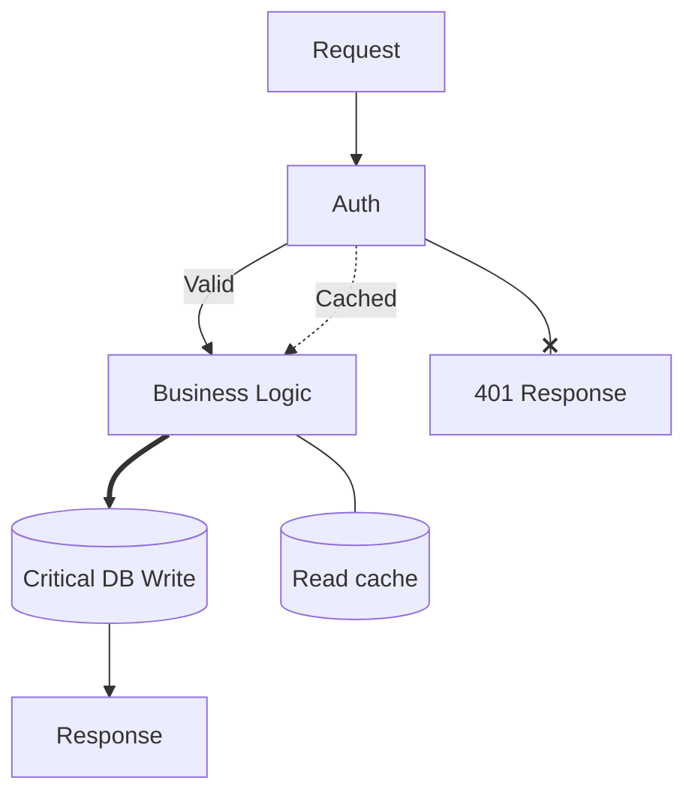

# Edge best practices — when to use which arrow

## What it does

Heuristics for picking among the 10+ Mermaid arrow styles so readers
can interpret the diagram without a legend.

## When to use

- Authoring a new flowchart and you're not sure which arrow to reach
  for.
- Reviewing a flowchart whose arrow meanings feel inconsistent.
- Building style conventions for a team's Mermaid library.

## The heuristic table

| Need | Arrow |
|------|-------|
| Default process flow | `A --> B` (solid arrow) |
| Async / weak coupling | `A -.-> B` (dotted arrow) |
| Critical / hot path | `A ==> B` (thick arrow) |
| Failure / error branch | `A --x B` (cross arrow) |
| Aggregation / non-directional | `A --o B` (open circle) |
| Association without direction | `A --- B` (solid line) |

## Label conventions

- Label every **decision branch** — `|Yes| / |No|` in rhombus
  outgoing edges.
- Label **rate-limited / delayed** transitions with the timing
  (`retries 3x`, `500ms`).
- Don't label edges that are obviously sequential — labels compete
  with the arrow for visual weight.

## Arrow density rule

If more than 50% of edges are thick (`==>`), thickness has lost its
emphasis meaning. Use sparingly — 1-3 thick arrows per diagram max.

## Minimal example — mixed arrows with purpose

## Gotchas

- Mixing arrow styles without a reason makes diagrams hostile to
  readers. Pick 2-3 styles per diagram and be consistent.
- Thick arrows often get interpreted as "more important data" —
  reserve for critical paths, not volume.
- The cross arrow (`--x`) is weakly supported by ASCII renderers —
  falls back to `--x B` in text form, which is ambiguous.

## Cross-references

- `TECH-edge-styles.md` — the full arrow syntax catalog.
- `TECH-flowchart-grammar.md` — the parent grammar.
- [`../SKILL.md`](../SKILL.md) — parent skill

