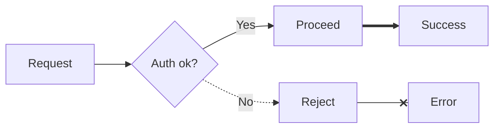

## Table of Contents

- [What it does](#what-it-does)
- [Line-and-arrow combinations](#line-and-arrow-combinations)
- [Inline label — two syntaxes](#inline-label-two-syntaxes)
- [Minimal example](#minimal-example)
- [Styling edges with `linkStyle`](#styling-edges-with-linkstyle)
- [Gotchas](#gotchas)
- [Cross-references](#cross-references)


# Edge styles — arrows, lines, labels

## What it does

Exhaustive reference for the arrow / line / label syntax in Mermaid
flowcharts. Every edge in a `flowchart` has three dimensions to
configure: line style, arrowhead, inline label.

## Line-and-arrow combinations

```
A --> B          Solid arrow             (default async/directional)
A --- B          Solid line              (no arrowhead — association)
A -.-> B         Dotted arrow            (async, weaker coupling)
A -.- B          Dotted line             (soft link)
A ==> B          Thick solid arrow       (critical path)
A === B          Thick solid line        (no arrowhead)
A -->|label| B   Arrow with inline label (alt syntax)
A --text--> B    Arrow with inline label (inline comment syntax)
A --o B          Open circle arrow       (aggregation feel)
A --x B          Cross arrow             (failed / error path)
```

## Inline label — two syntaxes

```
A -- label --> B          Inline comment
A -->|label| B            Pipe-delimited label
```

Both render identically. The pipe form is preferred for readability
when labels contain hyphens or arrow glyphs.

## Minimal example



## Styling edges with `linkStyle`

```
flowchart LR
    A --> B
    B --> C
    linkStyle 0 stroke:#e74c3c,stroke-width:2
    linkStyle 1 stroke:#2ecc71,stroke-width:2
```

`linkStyle N` targets the N-th arrow (0-indexed by source order).

## Gotchas

- Ordering matters for `linkStyle` — if you add/remove a link before
  the style, the index shifts.
- Thick arrows (`==>`) can visually overpower the diagram — reserve
  for literal "this path is the hot path" emphasis.
- Inline labels with special characters (`|`, `:`) need quoting:
  `A -->|"1:N"| B`.

## Cross-references

- [TECH-flowchart-grammar](TECH-flowchart-grammar.md) — the arrows live inside flowcharts.
- [TECH-sequence-grammar](TECH-sequence-grammar.md) — sequence arrows use a different
  syntax (`->>`, `-->>`).
- [TECH-edge-best-practices](TECH-edge-best-practices.md) — when to use dotted vs solid, thick
  vs thin.
- [`../SKILL.md`](../SKILL.md) — parent skill

