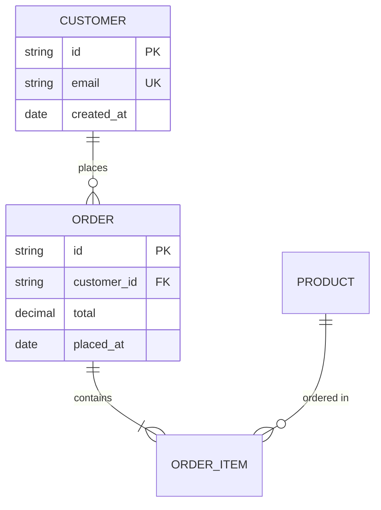

## Table of Contents

- [What it does](#what-it-does)
- [When to use](#when-to-use)
- [The rules](#the-rules)
- [Cardinality clarity](#cardinality-clarity)
- [Minimal example — good style](#minimal-example-good-style)
- [Gotchas](#gotchas)
- [Cross-references](#cross-references)

# ER diagram best practices

## What it does

Authoring heuristics for `erDiagram` — naming conventions,
cardinality choice, which attributes to show.

## When to use

- Authoring a new ER diagram for a database schema.
- Reviewing an ER diagram with naming/style inconsistencies.

## The rules

1. **UPPERCASE entity names** — `CUSTOMER`, not `Customer`. Mermaid
   ER convention.
2. **snake_case attribute names** — `customer_id`, `created_at`.
   Matches SQL convention.
3. **Always mark PK and FK** — `string id PK`, `string cust_id FK`.
   Makes the diagram a real schema reference.
4. **Show only essential attributes** — if a table has 20 columns,
   show the 5 that tell the story. Others are implementation detail.
5. **Keep relationship labels clear** — "places", "contains",
   "owned by" — verbs that read naturally left-to-right.
6. **Limit to 6-8 entities per diagram** — flatten into multiple if
   more.

## Cardinality clarity

Pick the crowsfoot that matches your DB's real semantics:

| Semantics | Crowsfoot |
|-----------|-----------|
| A customer can have 0 or more orders | `CUSTOMER ||--o{ ORDER` |
| An order must have at least 1 item | `ORDER ||--|{ ORDER_ITEM` |
| A product is used in 0 or more order items | `PRODUCT ||--o{ ORDER_ITEM` |
| A user has exactly one profile (1:1) | `USER ||--|| PROFILE` |

"Can be zero" → `o`. "Must be one" → `|`. "Can be many" → `{`.

## Minimal example — good style

## Gotchas

- Entity names in crowsfoot relationships don't include the attribute
  block — it's just the name. Attributes go in a separate `{ ... }`
  block.
- Relationship labels with spaces need quoting: `: "ordered in"`.
- Don't show every column — show PKs, FKs, and the 2-3 business-meaningful
  attributes. Elide the rest (`...` convention).

## Cross-references

- [TECH-er-grammar](TECH-er-grammar.md) — syntax reference.
- [TECH-class-grammar](TECH-class-grammar.md) — when you'd rather show classes than
  tables.
- [`../SKILL.md`](../SKILL.md) — parent skill

