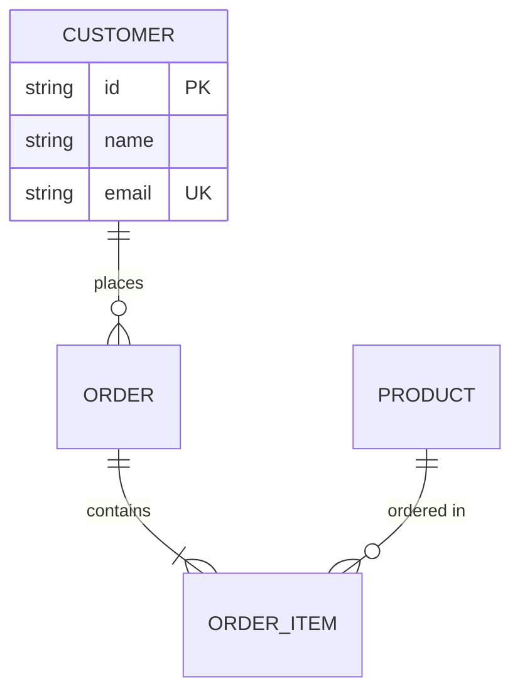

## Table of Contents

- [What it does](#what-it-does)
- [When to use](#when-to-use)
- [Basic syntax](#basic-syntax)
- [Cardinality crowsfeet](#cardinality-crowsfeet)
- [Attributes (optional but almost always used)](#attributes-optional-but-almost-always-used)
- [Attribute constraints](#attribute-constraints)
- [Minimal example](#minimal-example)
- [Gotchas](#gotchas)
- [Cross-references](#cross-references)


# ER diagram grammar (`erDiagram`)

## What it does

Authors entity-relationship diagrams — the classic DB schema format
with entities, attributes, primary/foreign keys, and cardinality
crowsfeet.

## When to use

- Database schema documentation.
- Data model diagrams for API reference docs.
- Domain modeling where the nouns are tables/collections.

## Basic syntax

```
erDiagram
    CUSTOMER ||--o{ ORDER : places
    ORDER ||--|{ ORDER_ITEM : contains
    PRODUCT ||--o{ ORDER_ITEM : "ordered in"
```

## Cardinality crowsfeet

```
||--||    One to one
}o--o{    Zero or more to zero or more
||--o{    One to zero or more
}o--||    Zero or more to one
||--|{    One to one or more
}|--|{    One or more to one or more
```

## Attributes (optional but almost always used)

```
erDiagram
    CUSTOMER {
        string id PK
        string name
        string email UK
        date created_at
    }

    ORDER {
        string id PK
        string customer_id FK
        decimal total
        date order_date
    }
```

## Attribute constraints

```
PK   Primary Key
FK   Foreign Key
UK   Unique Key
```

## Minimal example



## Gotchas

- Entity names must be UPPERCASE by convention — ER renderers will
  accept lowercase but the output looks off.
- Attribute types are free-form labels — `string`, `int`, `decimal`,
  `date`, `bool` are conventions, not enforced syntax.
- Relationship label goes AFTER `:` — the connecting verb: `places`,
  `contains`, `ordered in`. Quote if it has spaces.
- Limit to 6-8 entities — past that, flatten into multiple diagrams.

## Cross-references

- [TECH-class-grammar](TECH-class-grammar.md) — for OOP object models (similar cardinality shape).
  > What it does · When to use · Class definition · Visibility markers · Relationship arrows (UML) · Cardinality · Abstract / interface / generic · Minimal example · Gotchas · Cross-references
- [TECH-flowchart-grammar](TECH-flowchart-grammar.md) — when the data model is better shown
  > What it does · When to use · Node shapes (authoritative list) · Direction tokens · Connections · Minimal example · Gotchas · Cross-references
  as a graph than a schema.
- [[SKILL](../SKILL.md)](../SKILL.md) — parent skill

