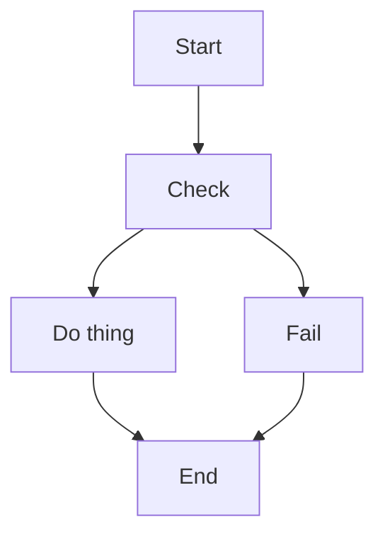
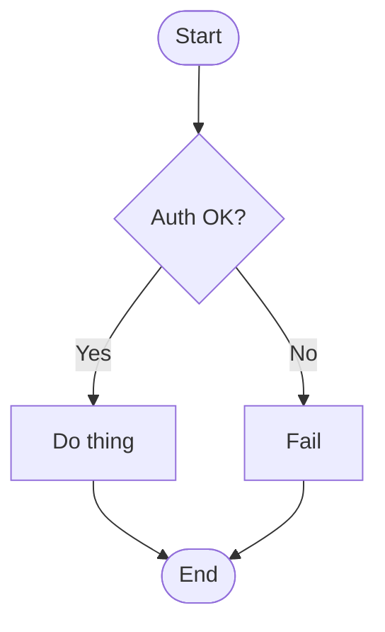

## Table of Contents

- [What it does](#what-it-does)
- [When to use](#when-to-use)
- [The rules](#the-rules)
- [Anti-patterns to reject](#anti-patterns-to-reject)
- [Minimal example — good vs bad](#minimal-example-good-vs-bad)
- [Gotchas](#gotchas)
- [Cross-references](#cross-references)

# Flowchart authoring best practices

## What it does

Heuristics for authoring readable flowcharts — direction, node
shapes, nesting, density.

## When to use

- Authoring a new flowchart from scratch.
- Refactoring an existing flowchart that "feels off".
- Reviewing flowcharts as part of a diagram style guide.

## The rules

1. **Use `LR` direction for wide screens** — `TD` can cause 20-node
   diagrams to need vertical scrolling.
2. **Keep decision nodes distinct** — use `{}` (rhombus) for
   branches, `[]` (rectangle) for processes.
3. **Use stadium shapes `([])` for start/end** — visually anchors
   the diagram's entry and exit.
4. **Limit nesting depth to 3 levels** — past that, split into
   multiple diagrams.
5. **Group related nodes with subgraphs** — visual clustering
   conveys architecture.
6. **Cap nodes at ~30 per diagram** — beyond 30, hierarchical
   decomposition beats a single mega-diagram.

## Anti-patterns to reject

- Mixed direction per subgraph without a reason — forces readers to
  re-orient mid-read.
- Decision nodes labeled "Check X?" without outgoing branches labeled
  (`|Yes|` / `|No|`) — readers can't tell which arrow is which.
- Walls of rectangles — every node the same shape erases the diagram's
  ability to convey role.
- Arrows with no labels where labels would help — "transition from
  state X to state Y under condition Z" needs "Z" on the arrow.

## Minimal example — good vs bad

**Bad (walls of rects, no shape variety):**

**Good (start/end stadium, decision rhombus, labeled branches):**

## Gotchas

- Shape overuse — don't use hexagons and trapezoids for novelty. 2-3
  shapes per diagram is enough.
- `graph` vs `flowchart` — both work, but `flowchart` is the modern
  keyword. Use it.

## Cross-references

- [TECH-flowchart-grammar](TECH-flowchart-grammar.md) — the syntax catalog.
  > What it does · When to use · Node shapes (authoritative list) · Direction tokens · Connections · Minimal example · Gotchas · Cross-references
- [TECH-subgraph-grouping](TECH-subgraph-grouping.md) — when to reach for grouped clusters.
  > What it does · When to use · Syntax · With direction override per subgraph · Minimal example · Gotchas · Cross-references
- [TECH-edge-best-practices](TECH-edge-best-practices.md) — arrow conventions.
  > What it does · When to use · The heuristic table · Label conventions · Arrow density rule · Minimal example — mixed arrows with purpose · Gotchas · Cross-references
- [[SKILL](../SKILL.md)](../SKILL.md) — parent skill
