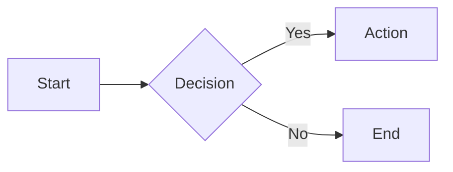

# Flowchart grammar — nodes, shapes, direction

## What it does

The Mermaid `flowchart` (also `graph`) grammar authors a directed
graph of labeled nodes connected by arrows. It's the most common
Mermaid diagram type — processes, workflows, decision trees.

## When to use

- Documenting a process / workflow with one start and one end.
- Decision trees — `{Rhombus}` nodes for branches.
- System flows with 5-30 nodes.

## Node shapes (authoritative list)

```
[Text]      Rectangle             (default)
([Text])    Stadium               (rounded ends — start/end)
[[Text]]    Subroutine            (double border)
[(Text)]    Cylindrical           (database)
((Text))    Circle
>Text]      Asymmetric            (rarely used)
{Text}      Rhombus               (decision)
{{Text}}    Hexagon               (preparation)
[/Text/]    Parallelogram         (input/output)
[\Text\]    Trapezoid alt
```

## Direction tokens

```
flowchart LR     Left-to-right    (widescreen)
flowchart TD     Top-down         (portrait, default in many renderers)
flowchart TB     Top-to-bottom    (alias of TD)
flowchart BT     Bottom-to-top    (inverted)
flowchart RL     Right-to-left    (inverted)
```

## Connections

```
A --> B          Arrow
A --- B          Line (no arrow)
A -.-> B         Dotted arrow
A ==> B          Thick arrow
A --text--> B    Arrow with inline text
A -->|text| B    Arrow with text (alt syntax)
```

## Minimal example



## Gotchas

- Use `LR` for wide screens — `TD` can cause 20-node diagrams to need
  vertical scrolling in a blog post.
- Decision nodes must be `{diamond}` — a regular `[rect]` node with
  the text "Decision" reads as a process, not a branch.
- `A-->B` (no spaces) works but `A -- B` (no arrow) fails silently —
  add the `--` explicitly. The renderer's error is cryptic.
- Limit nesting (subgraphs inside subgraphs) to 2 levels — readers
  lose the plot past that.

## Cross-references

- [TECH-subgraph-grouping](TECH-subgraph-grouping.md) — composite / nested flowcharts.
- [TECH-edge-styles](TECH-edge-styles.md) — arrows, labels, line styles in depth.
- [TECH-sequence-grammar](TECH-sequence-grammar.md) — the Mermaid cousin for API/message flows.
- [`../SKILL.md`](../SKILL.md) — parent skill

