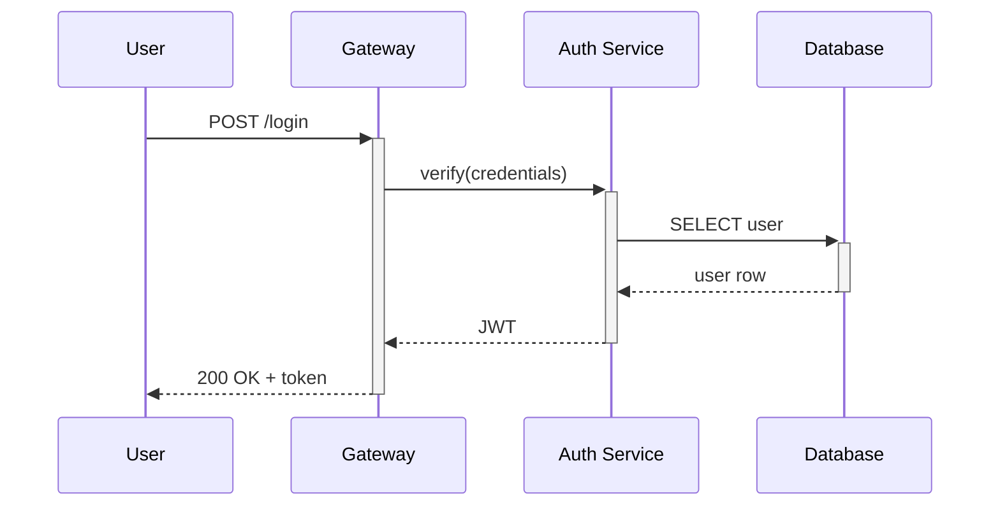

## Table of Contents

- [What it does](#what-it-does)
- [When to use](#when-to-use)
- [Syntax](#syntax)
- [Nested activations — double-stacking](#nested-activations-double-stacking)
- [Manual activate/deactivate (alt syntax)](#manual-activatedeactivate-alt-syntax)
- [Minimal example](#minimal-example)
- [Gotchas](#gotchas)
- [Cross-references](#cross-references)

# Sequence diagram activations

## What it does

The `+` and `-` suffixes on sequence diagram arrows activate and
deactivate the receiving participant's execution bar — visualising
when each actor is actively processing a request.

## When to use

- Showing request/response timing where latency matters.
- Highlighting that "between T1 and T2 the backend is busy".
- Nested calls — A calls B, which calls C; stacked activations show
  both B and C are busy at once.

## Syntax

```
sequenceDiagram
    A->>+B: Request         %% activates B
    B->>+C: Sub-request     %% activates C (nested)
    C-->>-B: Sub-response   %% deactivates C
    B-->>-A: Response       %% deactivates B
```

## Nested activations — double-stacking

```
sequenceDiagram
    A->>+B: Request
    B->>+B: Self-call (e.g. retry logic)
    B-->>-B: Done
    B-->>-A: Response
```

## Manual activate/deactivate (alt syntax)

```
sequenceDiagram
    A->>B: Request
    activate B
    B-->>A: Response
    deactivate B
```

Equivalent to `A->>+B` / `B-->>-A` — pick one form per diagram.

## Minimal example



## Gotchas

- Every `+` needs a matching `-`. Unbalanced activations crash the
  renderer with a confusing error.
- Activations on a participant that has none active (`A-->>-B` with
  no prior `A->>+B`) is a silent bug — the deactivation is ignored,
  but the arrow still draws.
- ASCII renderers show activations as slightly wider lifelines — the
  effect is less obvious than in SVG. For ASCII-only outputs, the
  activation adds noise without much value.

## Cross-references

- [TECH-sequence-grammar](TECH-sequence-grammar.md) — the parent grammar.
  > What it does · When to use · Participants · Message arrow types · Activations — show processing time · Notes · Loops & alt/else · Minimal example · Gotchas · Cross-references
- [TECH-sequence-notes-and-loops](TECH-sequence-notes-and-loops.md) — annotations and loops around
  > What it does · Notes · Loops · Alt/else · `opt` — optional block (one-sided alt) · `par` — parallel block · Minimal example — realistic API flow · Gotchas · Cross-references
  activated regions.
- [[SKILL](../SKILL.md)](../SKILL.md) — parent skill
