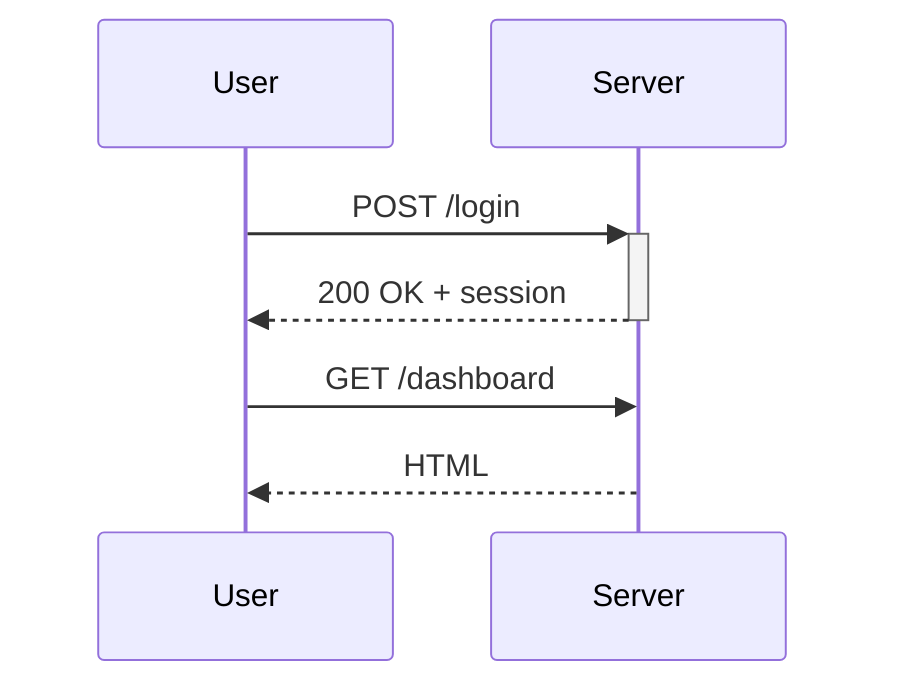

# Sequence diagram grammar

## Table of Contents

- [What it does](#what-it-does)
- [When to use](#when-to-use)
- [Participants](#participants)
- [Message arrow types](#message-arrow-types)
- [Activations — show processing time](#activations-show-processing-time)
- [Notes](#notes)
- [Loops & alt/else](#loops-altelse)
- [Minimal example](#minimal-example)
- [Gotchas](#gotchas)
- [Cross-references](#cross-references)

## What it does

`sequenceDiagram` grammar authors an interaction sequence between
participants (actors, services, users) showing messages and the order
they fire.

## When to use

- API call traces — client / server / database message flow.
- Authentication flows — user / browser / auth provider / API.
- Any multi-actor protocol with strict temporal ordering.

## Participants

```
sequenceDiagram
    participant A as Alice
    participant B as Bob
    participant C
    actor D
```

`actor D` uses a stick-figure icon — prefer for human roles; use
`participant` for services.

## Message arrow types

```
A->>B:   Solid arrow            (synchronous)
A-->>B:  Dotted arrow           (response)
A-xB:    Solid with cross       (failed / lost)
A--xB:   Dotted with cross      (failed response)
A-)B:    Solid open arrow       (async request)
A--)B:   Dotted open arrow      (async response)
```

## Activations — show processing time

```
sequenceDiagram
    A->>+B: Request
    B-->>-A: Response
```

`+` activates, `-` deactivates. Stacked rectangles on the participant
lifeline.

## Notes

```
sequenceDiagram
    Note left of A: Note on left
    Note right of B: Note on right
    Note over A,B: Note spanning both
```

## Loops & alt/else

```
sequenceDiagram
    loop Every minute
        A->>B: Ping
    end

    alt Success
        B-->>A: OK
    else Failure
        B-->>A: Error
    end
```

## Minimal example



## Gotchas

- Limit to 5-7 participants — past that, the diagram becomes unreadable.
- Activations (`+`/`-`) must balance — an unclosed `+` crashes the
  renderer with a confusing error.
- `par` (parallel) blocks exist but are poorly supported by ASCII
  renderers — prefer `alt/else` if you need ASCII output.

## Cross-references

- [TECH-flowchart-grammar](TECH-flowchart-grammar.md) — for non-temporal flows.
  > What it does · When to use · Node shapes (authoritative list) · Direction tokens · Connections · Minimal example · Gotchas · Cross-references
- [TECH-state-grammar](TECH-state-grammar.md) — for FSMs where time isn't the axis.
  > What it does · When to use · Basic syntax · Composite states — nested state machines · Choice pseudo-state — conditional branching · Concurrency — parallel regions · Notes · Minimal example · Gotchas · Cross-references
- [TECH-edge-styles](TECH-edge-styles.md) — not directly — sequence arrows differ from
  > What it does · Line-and-arrow combinations · Inline label — two syntaxes · Minimal example · Styling edges with `linkStyle` · Gotchas · Cross-references
  flowchart arrows.
- [[SKILL](../SKILL.md)](../SKILL.md) — parent skill
