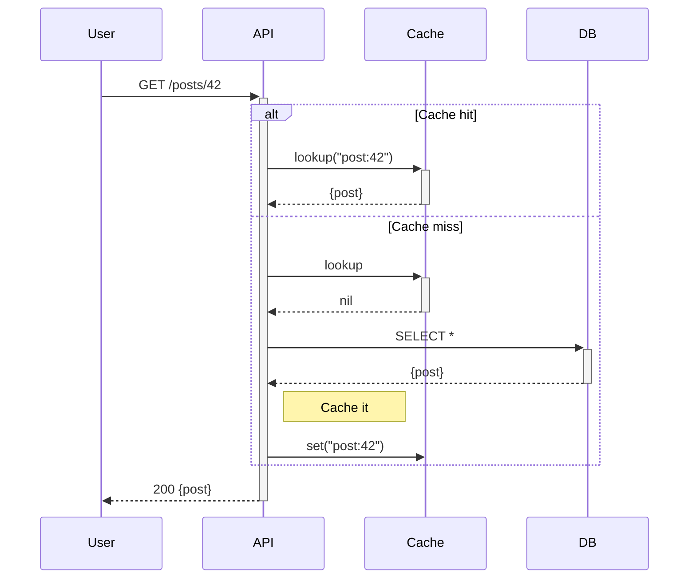

# Sequence diagram — notes, loops, alt/else blocks

## What it does

Three control-structure primitives in `sequenceDiagram`:
- **Notes** — free-text callouts next to participants.
- **Loops** — repeated interactions between participants.
- **Alt/else** — conditional branches with multiple outcomes.

## Notes

```
sequenceDiagram
    Note left of A: Note on left
    Note right of B: Note on right
    Note over A,B: Note spanning both
```

Notes don't consume a message slot — they're annotations, not
interactions.

## Loops

```
sequenceDiagram
    loop Every minute
        A->>B: Ping
        B-->>A: Pong
    end
```

Loop label is free-form — use it to describe the loop condition
("until response", "N times", "for each item").

## Alt/else

```
sequenceDiagram
    A->>B: Request
    alt Success
        B-->>A: 200 OK
    else Retry-able failure
        B-->>A: 503
    else Permanent failure
        B-->>A: 401
    end
```

Multiple `else` branches are legal — each renders as a separate
alternative region.

## `opt` — optional block (one-sided alt)

```
sequenceDiagram
    A->>B: Main request
    opt Include debug info
        B-->>A: Debug payload
    end
```

## `par` — parallel block

```
sequenceDiagram
    par Search cache
        A->>Cache: lookup
    and Search DB
        A->>DB: query
    end
```

**Warning:** `par` is poorly supported by ASCII renderers. Use
alt/else if ASCII output matters.

## Minimal example — realistic API flow



## Gotchas

- Nested loops / alts render but confuse readers — limit depth to 2.
- `Note over A,B` — comma, no space. `Note over A, B` is invalid.
- Renderers emit `loop`/`alt` as bordered rectangles — eyeballing
  nesting via indentation in the source does NOT affect output.

## Cross-references

- `TECH-sequence-grammar.md` — the parent grammar.
- `TECH-sequence-activations.md` — activation blocks nest inside
  loops / alts seamlessly.
- [`../SKILL.md`](../SKILL.md) — parent skill

