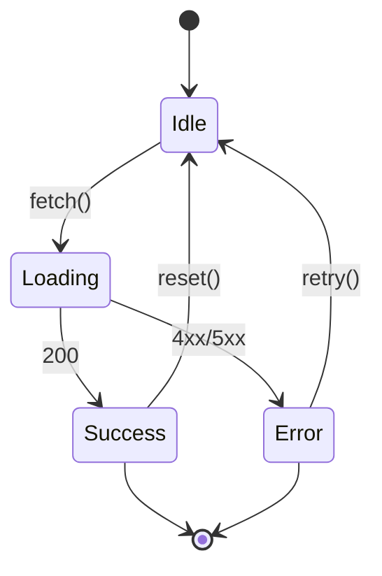

# State diagram grammar (`stateDiagram-v2`)

## Table of Contents

- [What it does](#what-it-does)
- [When to use](#when-to-use)
- [Basic syntax](#basic-syntax)
- [Composite states — nested state machines](#composite-states-nested-state-machines)
- [Choice pseudo-state — conditional branching](#choice-pseudo-state-conditional-branching)
- [Concurrency — parallel regions](#concurrency-parallel-regions)
- [Notes](#notes)
- [Minimal example](#minimal-example)
- [Gotchas](#gotchas)
- [Cross-references](#cross-references)


## What it does

Authors finite-state machines and state-transition graphs. Supports
composite states, choice/decision pseudo-states, concurrency, and
entry/exit transitions via `[*]`.

## When to use

- Application lifecycles (Loading / Idle / Active / Error).
- UI state machines — form state, auth state, onboarding.
- Protocol states — TCP connection lifecycle, Bluetooth pairing
  states.

## Basic syntax

```
stateDiagram-v2
    [*] --> State1
    State1 --> State2: Transition
    State2 --> [*]
```

`[*]` is the pseudo-initial / pseudo-final state.

## Composite states — nested state machines

```
stateDiagram-v2
    [*] --> Active

    state Active {
        [*] --> Running
        Running --> Paused
        Paused --> Running
        Running --> [*]
    }

    Active --> [*]
```

## Choice pseudo-state — conditional branching

```
stateDiagram-v2
    state if_state <<choice>>
    [*] --> if_state
    if_state --> State1: condition 1
    if_state --> State2: condition 2
```

## Concurrency — parallel regions

```
stateDiagram-v2
    [*] --> Active

    state Active {
        [*] --> Process1
        --
        [*] --> Process2
    }
```

The `--` divider inside a composite state creates parallel regions.

## Notes

```
stateDiagram-v2
    State1 --> State2
    note right of State1
        Important note here
    end note
```

## Minimal example



## Gotchas

- Always `stateDiagram-v2`, never the legacy `stateDiagram` — the v1
  grammar has bugs and is effectively deprecated.
- Limit composite state depth to 2 levels — 3+ breaks readability
  and most ASCII renderers.
- Labels on transitions go **after** `:` — `A --> B: label`, NOT
  `A --> B label`.
- Concurrency blocks (the `--` divider) are fragile — validate at
  mermaid.live before committing.

## Cross-references

- [TECH-flowchart-grammar](TECH-flowchart-grammar.md) — for non-state flows.
  > What it does · When to use · Node shapes (authoritative list) · Direction tokens · Connections · Minimal example · Gotchas · Cross-references
- [TECH-sequence-grammar](TECH-sequence-grammar.md) — for time-ordered interactions.
  > What it does · When to use · Participants · Message arrow types · Activations — show processing time · Notes · Loops & alt/else · Minimal example · Gotchas · Cross-references
- [[SKILL](../SKILL.md)](../SKILL.md) — parent skill

