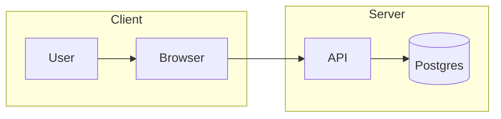

# Subgraphs — grouped nodes in flowcharts

## Table of Contents

- [What it does](#what-it-does)
- [When to use](#when-to-use)
- [Syntax](#syntax)
- [With direction override per subgraph](#with-direction-override-per-subgraph)
- [Minimal example](#minimal-example)
- [Gotchas](#gotchas)
- [Cross-references](#cross-references)


## What it does

Wraps a cluster of flowchart nodes in a labeled border. The
`subgraph Name ... end` block groups nodes visually AND in the
rendered layout algorithm (nodes inside are kept together).

## When to use

- Multi-service architectures — one subgraph per service / bounded
  context.
- Frontend/backend split — two subgraphs, arrows connecting them.
- Layered architectures — one subgraph per layer.

## Syntax

```
flowchart LR
    subgraph Frontend
        A[React UI]
        B[API Client]
    end

    subgraph Backend
        C[API Gateway]
        D[Auth Service]
        E[Database]
    end

    A --> B --> C --> D --> E
```

## With direction override per subgraph

```
flowchart TB
    subgraph Frontend
        direction LR
        A --> B
    end
    subgraph Backend
        direction TB
        C --> D --> E
    end
```

## Minimal example



## Gotchas

- Subgraph names are labels, not IDs — duplicate names render, but
  cross-referencing gets confusing.
- Limit to 2 levels of nesting — subgraph-inside-subgraph is legal
  but renders badly in ASCII output.
- Direction override per subgraph is a relatively recent feature —
  old `mermaid` versions (<9.1) ignore it silently.

## Cross-references

- [TECH-flowchart-grammar](TECH-flowchart-grammar.md) — the parent grammar.
  > What it does · When to use · Node shapes (authoritative list) · Direction tokens · Connections · Minimal example · Gotchas · Cross-references
- [TECH-edge-styles](TECH-edge-styles.md) — arrows between subgraphs can use different
  > What it does · Line-and-arrow combinations · Inline label — two syntaxes · Minimal example · Styling edges with `linkStyle` · Gotchas · Cross-references
  styles than arrows within.
- [[SKILL](../SKILL.md)](../SKILL.md) — parent skill

