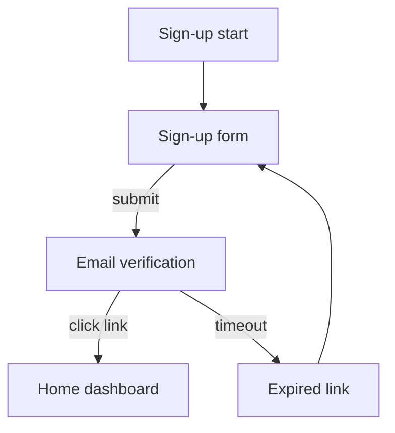

# TECH-stitch-design-language

## What it documents

The Stitch domain vocabulary, the canonical Stitch MCP tool surface (`mcp__stitch__*`), and how amw-* canonical formats map onto Stitch concepts. This file is the single source of truth for the tool-name table — the parent SKILL.md describes the contract and leaves the literal names here so upstream changes do not require editing the SKILL.

## Stitch vocabulary

Stitch organizes design work around five top-level concepts. The mapping below records each concept, its position in the Stitch data model, and the matching amw-* canonical format.

### 1. Workspace

A Stitch workspace is the outermost container — analogous to a "team" or "project" in other design platforms. A user account can have N workspaces; each workspace owns tokens, components, layouts, flows, and snapshots. The MCP authenticates against the workspace, not the design objects within it.

- **amw-* equivalent:** the project root in this plugin. One Stitch workspace is one ai-maestro-webdesign project.
- **Boundaries:** tokens are scoped to a workspace. A component in workspace A cannot inherit tokens from workspace B without an explicit cross-workspace reference (a rare and out-of-scope operation for this skill).

### 2. Design tokens

Stitch design tokens cover color, typography, spacing, radius, shadow, and motion. The internal representation is similar to the W3C Design Tokens Community Group schema with Stitch-specific extensions for semantic aliasing (e.g. `color.intent.danger` references `color.red.500`).

- **amw-* equivalent:** the `tokens.w3c.json` produced by `amw-design-extract` and consumed by `amw-design-md`. The translation is mostly mechanical (rename a few keys, flatten the alias layer) — the canonical translation table lives below in the [Translation table](#translation-table-stitch--amw) section.
- **Boundaries:** semantic aliases in Stitch translate to W3C token references using the `{path.to.token}` syntax. The translator preserves alias depth; it does not flatten.

### 3. Components

A Stitch component is a UI primitive (button, card, input, modal) plus its variant matrix. Each component has a manifest (props, slots, design-token references) and zero or more visual renderings.

- **amw-* equivalent:** the `component-inventory.md` consumed by `amw-design-md` and `amw-component-library-architect-agent`. The variant matrix becomes a rows-by-columns table; design-token references become inline `{token.path}` callouts.
- **Boundaries:** rendered images are not pulled — only the manifest. Image extraction belongs to `amw-dev-browser` working against the Stitch web UI, not this skill.

### 4. Layouts

A Stitch layout is a named grid or stack pattern: a 12-column responsive grid, a sidebar-plus-main shell, a centered hero, a card grid with a specific gap rhythm. Layouts reference tokens (gaps, breakpoints, gutters) and components (which one goes in which slot).

- **amw-* equivalent:** an ASCII wireframe pack (see `amw-ascii-sketch` and `amw-ascii-to-html`). The layout slot map translates to ASCII regions; the token references translate to comments in the wireframe header.
- **Boundaries:** a Stitch layout describes structure, not content. Copy belongs to `amw-multilanguage-copywriter-agent`, not this skill.

### 5. Flows

A Stitch flow is a user-flow graph: nodes are screens or states, edges are user actions or system transitions. Flows reference layouts (which screen has which layout) and components (which interactive component triggers which edge).

- **amw-* equivalent:** a Mermaid `flowchart` or `stateDiagram-v2` source rendered through `amw-mermaid-render`. Stitch nodes become Mermaid nodes; Stitch edges become Mermaid edges; Stitch layout references become Mermaid node annotations.
- **Boundaries:** the Mermaid output is the canonical form. The Stitch flow's visual layout (node positions on the canvas) is discarded — Mermaid re-lays-out automatically. Round-trip preservation of canvas positions is not in scope for the scaffold stage.

## Canonical MCP tool surface

The Stitch MCP server exposes its surface under the `mcp__stitch__*` namespace. The tool names recorded below are the canonical names as of the scaffold date; they may evolve and this file is the only place those names should appear in the plugin.

### Read tools (probe + pull)

| Tool name | Purpose | Inputs | Returns |
|---|---|---|---|
| `mcp__stitch__ping` | Probe — confirm the server is reachable and authenticated | none | server version + workspace list |
| `mcp__stitch__list_workspaces` | List workspaces the auth principal can access | `limit?`, `cursor?` | array of workspace summaries |
| `mcp__stitch__get_workspace` | Workspace metadata + counts | `workspace_id` | workspace detail |
| `mcp__stitch__get_tokens` | Fetch the token set for a workspace | `workspace_id`, `format?` (`w3c`, `style-dictionary`, `figma`) | token document |
| `mcp__stitch__list_components` | Enumerate components in a workspace | `workspace_id`, `limit?`, `cursor?`, `filter?` | array of component summaries |
| `mcp__stitch__get_component` | Component manifest (props, slots, variants, token refs) | `workspace_id`, `component_id` | component detail |
| `mcp__stitch__list_layouts` | Enumerate layouts in a workspace | `workspace_id`, `limit?`, `cursor?` | array of layout summaries |
| `mcp__stitch__get_layout` | Layout structure (grid, slots, token refs) | `workspace_id`, `layout_id` | layout detail |
| `mcp__stitch__list_flows` | Enumerate user flows | `workspace_id`, `limit?`, `cursor?` | array of flow summaries |
| `mcp__stitch__get_flow` | Flow graph (nodes, edges, screen refs) | `workspace_id`, `flow_id` | flow detail |

### Write tools (push)

| Tool name | Purpose | Inputs | Returns |
|---|---|---|---|
| `mcp__stitch__push_tokens` | Replace the workspace token set with a new W3C tokens document | `workspace_id`, `tokens_w3c_json`, `dry_run?` | diff summary + new revision id |
| `mcp__stitch__push_component` | Create or update a component manifest | `workspace_id`, `component_manifest`, `dry_run?` | new revision id |
| `mcp__stitch__push_layout` | Create or update a layout | `workspace_id`, `layout_definition`, `dry_run?` | new revision id |
| `mcp__stitch__push_flow` | Create or update a flow | `workspace_id`, `flow_definition`, `dry_run?` | new revision id |

The actual tool names are subject to upstream change. The skill body never hardcodes a tool name; it looks it up in this table at runtime by intent class. If the upstream API renames a tool, edit ONLY this table — the SKILL contract stays stable.

## Translation table: Stitch ↔ amw

### Tokens — Stitch JSON → amw-* W3C JSON

| Stitch path | W3C tokens path | Notes |
|---|---|---|
| `tokens.color.<scale>.<step>` | `color.<scale>.<step>.value` | The value is preserved verbatim (oklch or hex). Type metadata becomes `$type: "color"`. |
| `tokens.color.intent.<role>` | `color.intent.<role>.value` | Stitch alias references (`{color.red.500}`) become W3C alias references (`{color.red.500}`). The syntax matches by design. |
| `tokens.font.family.<role>` | `typography.family.<role>.value` | Font family strings preserved verbatim. |
| `tokens.font.size.<step>` | `typography.size.<step>.value` | Sizes are rem in Stitch; the translator preserves the unit. |
| `tokens.space.<step>` | `spacing.<step>.value` | Spacing scale preserved verbatim. |
| `tokens.radius.<step>` | `radius.<step>.value` | Border-radius values preserved verbatim. |
| `tokens.shadow.<step>` | `shadow.<step>.value` | Shadow definitions translate as composite tokens (`offset-x`, `offset-y`, `blur`, `spread`, `color`). |
| `tokens.motion.duration.<step>` | `motion.duration.<step>.value` | Duration preserved verbatim with `ms` unit. |
| `tokens.motion.easing.<role>` | `motion.easing.<role>.value` | Easing cubic-bezier or named token preserved verbatim. |

### Components — Stitch manifest → amw-* component-inventory.md

A Stitch component manifest carries `id`, `name`, `props[]`, `slots[]`, `variants[]`, `token_refs[]`. The component-inventory.md row format is:

```
### <component name>

- **Variants:** <variant1> · <variant2> · <variant3>
- **Slots:** <slot1> · <slot2>
- **Tokens consumed:** {color.intent.primary} · {spacing.4} · {radius.md}
- **Source:** Stitch workspace <workspace_id>, component <component_id>, revision <revision_id>
```

The translator emits one section per component, in alphabetical order by component name. The `Source` line preserves the Stitch identifiers so a later round-trip is unambiguous.

### Layouts — Stitch layout → amw-* ASCII wireframe header

A Stitch layout becomes an ASCII wireframe with a header comment that records the grid, the slots, and the token references. The body of the wireframe (the actual ASCII art) is authored by `amw-ascii-sketch` from the slot map; this skill does not invent ASCII. The header looks like:

```
# Layout: <layout name>
# Source: Stitch workspace <workspace_id>, layout <layout_id>, revision <revision_id>
# Grid: <columns>-column at <breakpoint>, gap {spacing.4}
# Slots: header, sidebar, main, footer
```

### Flows — Stitch flow → Mermaid source

A Stitch flow becomes a Mermaid `flowchart TD` (top-down) or `stateDiagram-v2` (when the flow has explicit states). Nodes carry the Stitch node id as a stable Mermaid id; edges carry the Stitch action label as the Mermaid edge label. Example:



The `amw-mermaid-render` skill consumes this output and renders SVG or ASCII.

## Worked example — pulling components into a DESIGN.md draft

`amw-design-md-author-agent` is producing a DESIGN.md for the `acme-marketing` project. It detects a Stitch trigger ("import the component list from stitch workspace acme-marketing"). It routes to this skill.

1. Probe: `mcp__stitch__ping` returns `{ "version": "0.6.2", "workspaces": ["acme-marketing", "acme-internal"] }`. Success.
2. Intent class: `pull-components`. The user named the workspace explicitly so no disambiguation is needed.
3. Tool: `mcp__stitch__list_components` with `workspace_id: "acme-marketing"`. Returns a 14-component summary array.
4. Per-component tool: `mcp__stitch__get_component` for each, batched. Returns full manifests.
5. Translation: produce a 14-section component-inventory.md per the table above.
6. Hand-off: write `<project>/design/component-inventory.md` and emit the path back to `amw-design-md-author-agent`.
7. Report: workspace id, server version, tool names called, artifact path, hand-off recipient.

## Cross-references

- [SKILL](../SKILL.md) — Parent skill; describes the activation contract that drives this reference.
- [TECH-stitch-fallback-strategy](./TECH-stitch-fallback-strategy.md) — The fallback chain when the MCP probe fails.
- [SKILL](../../amw-design-md/SKILL.md) — Downstream consumer of translated tokens and component manifests.
- [SKILL](../../amw-design-extract/SKILL.md) — Sibling URL-based extractor; lives in the fallback chain.
- [SKILL](../../amw-mermaid-render/SKILL.md) — Renders the translated Mermaid flow source.
- [SKILL](../../amw-ascii-sketch/SKILL.md) — Authors the ASCII body that fills the layout header this skill emits.
