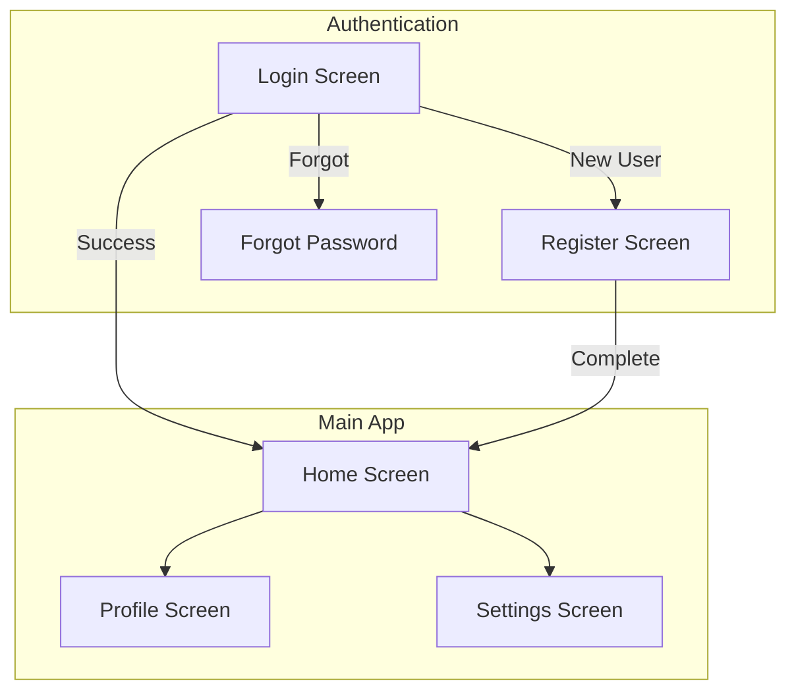
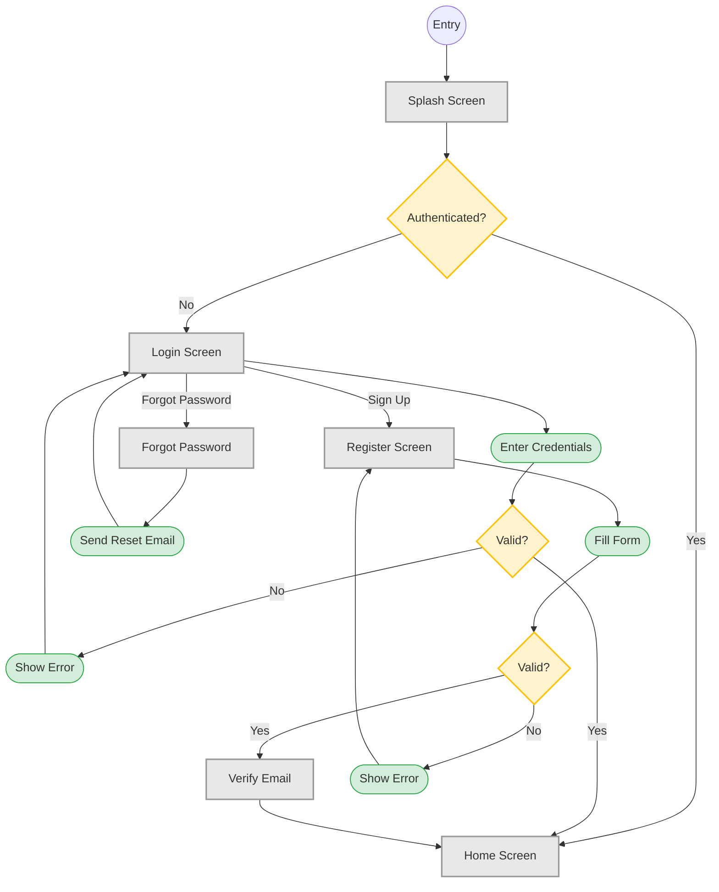

# TECH-mermaid-flowchart-screen-map

## What it does

Generates the **master screen map** — one `graph TD` Mermaid flowchart
showing every screen in the app and the general navigation paths
between them. Uses subgraphs to group screens by feature area (Auth,
Main, Settings), consistent node shapes for entry points / screens /
decisions / actions.

## When to use

- **Phase 2 step 1** of the `ux-flows` workflow — every invocation.
- **Whenever the user wants an at-a-glance view** of the app's screen
  topology.
- **Before per-use-case diagrams** — the screen map is the root, every
  per-UC flow references screens from it.

## How it works

Fixed node-shape vocabulary:

```
[Screen Name]       — Rectangle: screens/pages
{Decision?}         — Diamond: conditional branch
((Start))           — Circle: entry point
([Action])          — Stadium: user action (tap, submit)
[[Sub-flow]]        — Subroutine: link to another diagram
>Result]            — Asymmetric: outcome / redirect
```

Subgraphs group screens by feature area:



Styling via `classDef` (reusable across all diagrams):

```
classDef screen fill:#e8e8e8,stroke:#999,stroke-width:2px
classDef decision fill:#fff3cd,stroke:#ffc107,stroke-width:2px
classDef action fill:#d4edda,stroke:#28a745,stroke-width:1px
classDef error fill:#f8d7da,stroke:#dc3545,stroke-width:1px
```

Apply classes at the bottom of the diagram:

```
class Login,Register,ForgotPW,Home screen
class CheckAuth,Validate decision
class InputCreds,ShowError action
```

## Minimal example

Complete login flow with decisions, actions, and error paths:



## Gotchas

- **Max 15–20 nodes per diagram.** Larger diagrams split into sub-flows
  linked with `[[Sub-flow]]` nodes, each pointing to a dedicated
  diagram file (see `TECH-split-large-flows-subflow-linking.md`).
- **Max 3–4 subgraphs per diagram.** More subgraphs visually compete and
  the screen map stops serving its "at-a-glance" purpose.
- **PascalCase screen names, camelCase action names.** `HomeScreen` and
  `submitForm`, not `home screen` or `SubmitForm`. Keep naming
  consistent across all diagrams in the workflow.
- **Short edge labels.** `Success`, `Fail`, `Tap`, `Submit`, `Forgot` —
  3–8 characters. Longer labels overflow in Mermaid's auto-layout.
- **Edge labels all or none.** If any edge has a label, every
  decision-originating edge should have one. Mixing labelled and
  unlabelled decision edges leaves the reader guessing.

## Cross-references

- `../SKILL.md` — Phase 2 of the workflow
- `mermaid-patterns.md` — the full reference bundled in the skill
- `TECH-mermaid-state-diagram-screen.md` — per-UC state diagrams
- `TECH-mermaid-sequence-authenticated.md` — per-UC sequence diagrams
- `TECH-split-large-flows-subflow-linking.md` — splitting strategy
- `../../amw-diagram-editorial/references/TECH-type-flowchart.md` — editorial
  HTML+SVG cousin when the flowchart graduates to a blog asset
