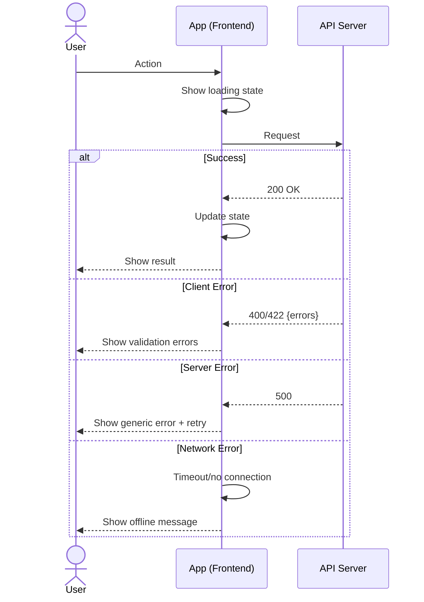
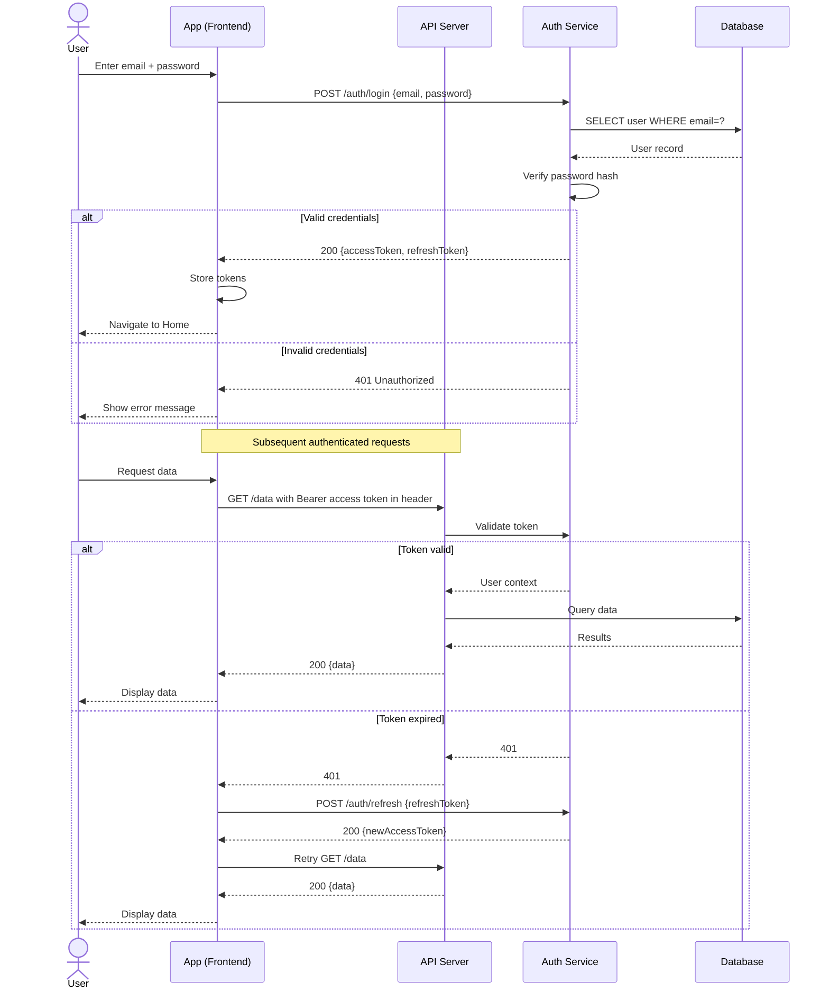

## Table of Contents

- [What it does](#what-it-does)
- [When to use](#when-to-use)
- [How it works](#how-it-works)
  - [Actor reference](#actor-reference)
  - [Message syntax](#message-syntax)
  - [Error-handling pattern](#error-handling-pattern)
- [Minimal example](#minimal-example)
- [Gotchas](#gotchas)
- [Cross-references](#cross-references)

# TECH-mermaid-sequence-authenticated

## What it does

Generates a **per-UC sequence diagram** showing frontend-backend
interaction with HTTP methods, auth tokens, and branching error
handling. Uses Mermaid's `sequenceDiagram` syntax with `alt` / `else`
blocks for branches. Lives at
`docs/ux-flows/diagrams/{uc-id}/sequence.md`.

## When to use

- **Every use case that crosses the frontend/backend boundary.** Login,
  search, form submission, file upload, webhook receipt.
- **Phase 2 step 2** of the `ux-flows` workflow — alongside the
  flowchart and state diagram.
- **Whenever the reader needs to see the actual HTTP calls** rather than
  abstract "user submits form" events.

Do not use for screen navigation (flowchart) or internal UI state
(state diagram).

## How it works

### Actor reference

Standard actors for UX flow sequence diagrams:

| Actor | Label | Use |
|---|---|---|
| `actor User` | End user | Human interactions |
| `participant App` | Frontend app | Client-side logic |
| `participant API` | API Server | Backend endpoints |
| `participant Auth` | Auth Service | Authentication / token service |
| `participant DB` | Database | Data persistence |
| `participant Cache` | Cache | Redis / in-memory |
| `participant Queue` | Queue | Async jobs |
| `participant Email` | Email Service | Notifications |

### Message syntax

- `->>` — solid arrow (request)
- `-->>` — dashed arrow (response)
- `+` / `-` after actor — activation rectangle start/end (optional)
- `Note over A,B:` — annotation bridging two actors
- `alt ... else ... end` — branching alternatives

### Error-handling pattern

## Minimal example

Authenticated request with token refresh (attributed to
[mermaid-patterns](mermaid-patterns.md)):

## Gotchas

- **Use `-->>` for responses**, `->>` for requests. Flipping this
  convention breaks the reader's pattern-matching instantly.
- **HTTP methods go on the request line** (`POST /auth/login`), not in
  a separate message. Compact notation keeps the diagram readable.
- **`Note over` for context**, not inside `alt` blocks. Place notes
  between major sections to separate them visually.
- **Max ~15 messages per diagram.** Longer sequences should split into
  per-phase diagrams (login-only, token-refresh-only).
- **Don't use participant activation rectangles (`+` / `-`) unless they
  add clarity.** Most UX sequences don't need them; they add visual
  noise for little benefit.
- **Token refresh is always shown as a nested `alt`** — the "token
  expired" branch kicks off a refresh sub-flow, then retries the
  original request. Leaving the refresh implicit hides the critical UX
  moment when the app could show a "refreshing session..." spinner.

## Cross-references

- [SKILL](../SKILL.md) — Phase 2 of the workflow
- [mermaid-patterns](mermaid-patterns.md) — the full reference bundled in the skill
  > Flowchart Patterns · State Diagram Patterns · Sequence Diagram Patterns · Best Practices
- [TECH-mermaid-flowchart-screen-map](TECH-mermaid-flowchart-screen-map.md) — sibling flowchart diagram
  > What it does · When to use · How it works · Minimal example · Gotchas · Cross-references
- [TECH-mermaid-state-diagram-screen](TECH-mermaid-state-diagram-screen.md) — sibling state diagram
  > What it does · When to use · How it works · Basic transitions · Nested states · Parallel states · Minimal example · Gotchas · Cross-references
- [TECH-type-sequence](../../amw-diagram-editorial/references/TECH-type-sequence.md) — editorial
  > What it does · When to use · How it works · Minimal example · Gotchas · Cross-references
  HTML+SVG cousin for blog-ready sequence diagrams
