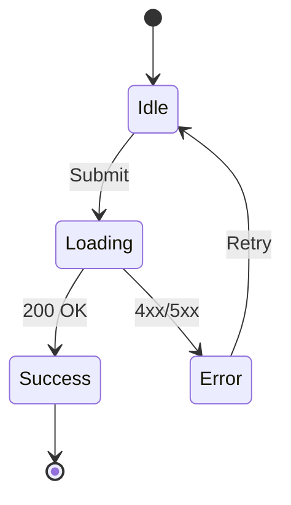
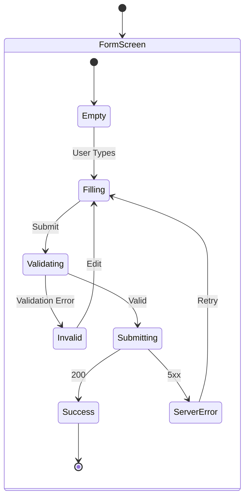
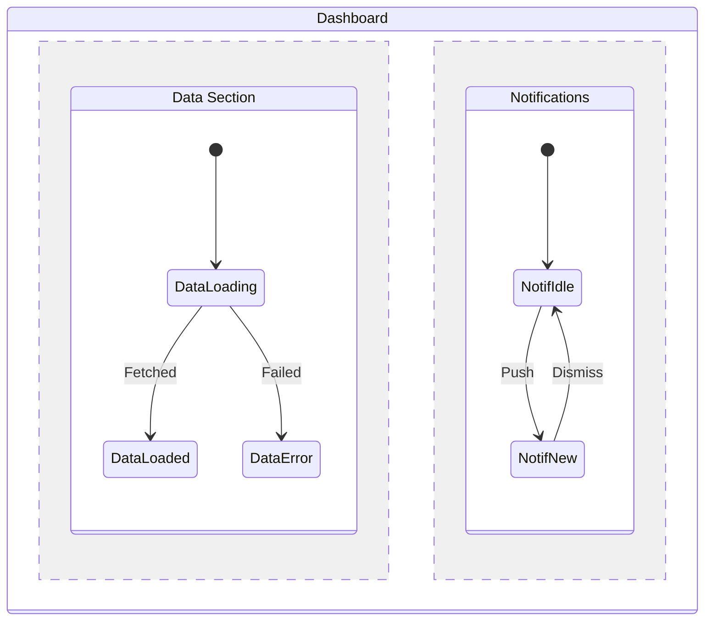
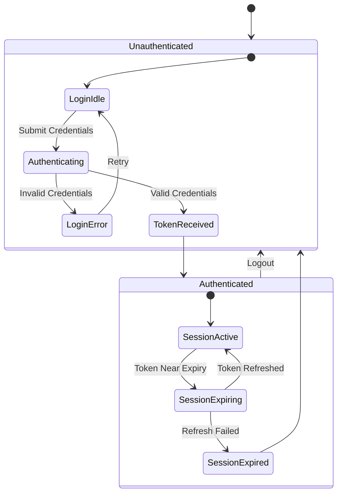

## Table of Contents

- [What it does](#what-it-does)
- [When to use](#when-to-use)
- [How it works](#how-it-works)
  - [Basic transitions](#basic-transitions)
  - [Nested states](#nested-states)
  - [Parallel states](#parallel-states)
- [Minimal example](#minimal-example)
- [Gotchas](#gotchas)
- [Cross-references](#cross-references)

# TECH-mermaid-state-diagram-screen

## What it does

Generates a **per-screen state diagram** in Mermaid `stateDiagram-v2`
syntax — captures all UI states a screen can be in (idle, loading,
filling, validating, error, success) and the events that move between
them. The diagram lives at `docs/ux-flows/diagrams/{uc-id}/states.md`.

## When to use

- **Every use case that has non-trivial UI state.** Forms, listings
  with filters, media-uploading flows, infinite-scroll feeds.
- **Phase 2 step 2** of the `ux-flows` workflow — once per approved
  UC.
- **Whenever the reader needs to see what UI states exist** alongside
  the happy-path flowchart.

Do not use for the screen map (that's a flowchart) or for client-server
interaction (that's a sequence diagram).

## How it works

### Basic transitions

Special markers:
- `[*]` — initial or terminal state
- `-->` — transition; the text after the colon is the triggering event

### Nested states

When a screen has internal substates (a form has "empty", "filling",
"validating", "submitting"), wrap them in a `state` block:

### Parallel states

For screens with independent state regions (a dashboard's data section
AND notification section both cycling independently):

The `--` separator marks parallel regions.

## Minimal example

Auth flow with authenticated/unauthenticated as top-level states:

## Gotchas

- **Every state must be reachable from `[*]`.** Isolated states are a
  bug — either remove them or add the transition that reaches them.
- **Every non-terminal state has at least one outgoing transition.**
  Dead-end states without a terminal marker are the #1 source of "stuck
  user" bugs in production.
- **State names in PascalCase**, events in sentence-case (`Submit`, `Retry`,
  `Token Near Expiry`). Keep the case distinction consistent with the
  flowchart and sequence diagrams.
- **Max ~10 states per diagram.** More states = switch to nested states
  or parallel regions; don't flatten everything.
- **Use `as` aliases for multi-word state names.** `state "Data Section"
  as Data` — Mermaid has a strict syntax for state IDs that can't
  contain spaces.

## Cross-references

- [SKILL](../SKILL.md) — Phase 2 of the workflow
- [mermaid-patterns](mermaid-patterns.md) — the full reference bundled in the skill
  > Flowchart Patterns · State Diagram Patterns · Sequence Diagram Patterns · Best Practices
- [TECH-mermaid-flowchart-screen-map](TECH-mermaid-flowchart-screen-map.md) — sibling flowchart diagram
  > What it does · When to use · How it works · Minimal example · Gotchas · Cross-references
- [TECH-mermaid-sequence-authenticated](TECH-mermaid-sequence-authenticated.md) — sibling sequence diagram
  > What it does · When to use · How it works · Actor reference · Message syntax · Error-handling pattern · Minimal example · Gotchas · Cross-references
- [TECH-type-state-machine](../../amw-diagram-editorial/references/TECH-type-state-machine.md) —
  > What it does · When to use · How it works · Minimal example · Gotchas · Cross-references
  editorial HTML+SVG cousin for blog-ready state diagrams
