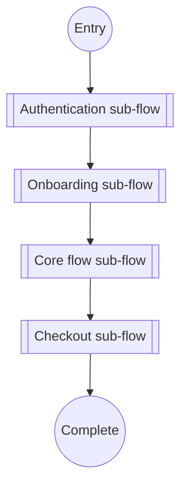
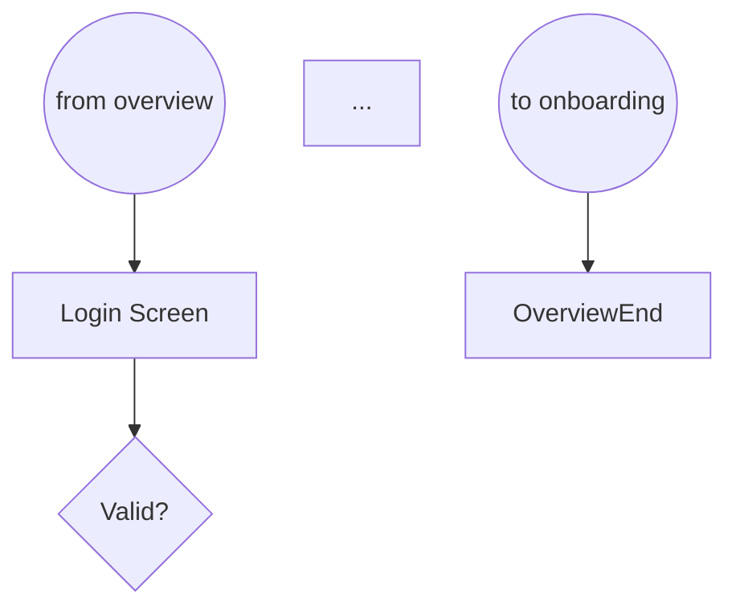
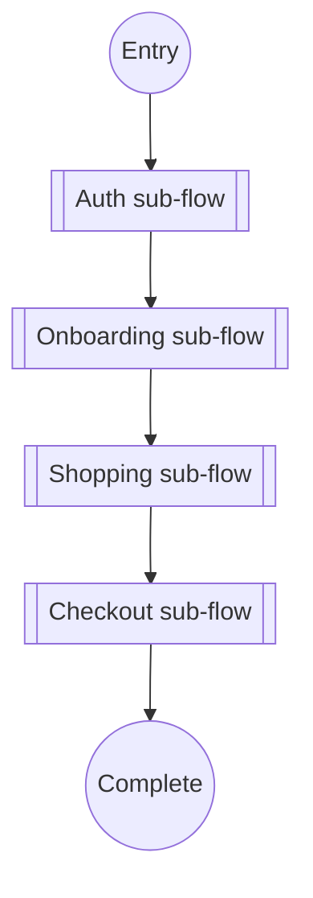

# TECH-split-large-flows-subflow-linking

## What it does

Splits a single oversized Mermaid flow (>20 nodes) into a high-level
flow plus detailed sub-flows, linked via the `[[Sub-flow]]` node shape.
The rule prevents the "single unreadable diagram" failure mode where a
complex user journey tries to fit into one flowchart.

## When to use

- **Whenever a single flow exceeds 20 nodes.** Mermaid's auto-layout
  degrades noticeably past 15-20 nodes; beyond that, reader
  comprehension drops sharply.
- **When logical boundaries exist** — auth flow, onboarding flow,
  checkout flow, core feature flow. Each one becomes its own diagram.
- **When the user explicitly wants an overview + detail view** — the
  split is the right primitive.

Do not pre-emptively split flows under 15 nodes. Single cohesive
diagrams are more readable than split ones when size permits.

## How it works

### Step 1 — Identify logical boundaries

Walk the oversized flow and look for natural "chapters":
- Authentication / authorisation
- Onboarding / setup
- Happy-path core feature
- Alternative / error paths
- Checkout / payment
- Confirmation / post-action

Each chapter typically has 5-10 nodes — ideal sub-flow size.

### Step 2 — Create a high-level overview flow

The overview uses `[[Sub-flow]]` nodes for each chapter, linked with
normal edges showing the order:



Each `click` directive links to the sub-flow's dedicated file.

### Step 3 — Create each sub-flow as a separate diagram

Each sub-flow file is a normal `graph TD` flowchart at 5-15 nodes,
named with a `sub-` prefix:

```
docs/ux-flows/diagrams/uc-001/
├── flow.md           ← high-level overview (with [[Sub-flow]] nodes)
├── sub-auth.md
├── sub-onboarding.md
├── sub-main.md
└── sub-checkout.md
```

The sub-flow files reference back to the overview with a text note:

```markdown
# UC-001 · Authentication Sub-flow

> Part of [UC-001 overview flow](./flow.md). See also: [states.md](./states.md), [sequence.md](./sequence.md).


```

## Minimal example

Before split — single 23-node flow (unreadable):

```mermaid
graph TD
    Start((Entry)) --> Splash --> CheckAuth{Authed?}
    CheckAuth -->|Yes| Home
    CheckAuth -->|No| Login
    Login --> InputCreds --> Validate{Valid?}
    Validate -->|No| ShowError --> Login
    Validate -->|Yes| CheckProfile{Profile Complete?}
    CheckProfile -->|Yes| Home
    CheckProfile -->|No| Onboard1 --> Onboard2 --> Onboard3 --> Home
    Home --> BrowseCatalog --> ViewProduct --> AddToCart
    AddToCart --> ViewCart --> Checkout --> EnterShipping
    EnterShipping --> EnterPayment --> ReviewOrder --> ConfirmOrder
    ConfirmOrder --> OrderSuccess --> End((Done))
    ... etc
```

After split — 5-node overview + 4 sub-flows:



Each sub-flow diagram stands alone, referenced by the overview's
`click` directives and by sibling sub-flows' "to <next>" terminal
markers.

## Gotchas

- **`[[Double square brackets]]`** is the Mermaid syntax for
  sub-routine / sub-flow nodes. `[Single brackets]` is a regular
  screen; `{curly braces}` is a decision. Mixing them breaks the
  reader's pattern-matching.
- **Use `click NodeId "./path.md" _blank`** for clickable sub-flow
  links. Without the click directive, the sub-flow reference is
  visual-only — users have to hunt for the file manually.
- **Sub-flow entry/exit match.** The sub-flow's start node pairs with
  the overview's edge ending at the sub-flow; the sub-flow's end node
  pairs with the overview's edge starting from the sub-flow. Mis-matched
  pairs confuse the reader about where sub-flow transitions happen.
- **`[[Sub-flow]]` label is short** — "Auth", "Checkout", "Onboarding".
  Not "Authentication sub-flow with password reset, email verification,
  and 2FA optional". Detail lives in the sub-flow, not the overview.
- **Max depth = 2.** Overview flow → sub-flow → leaf. Never nest
  sub-flows three levels deep; at that point the overview should split
  differently.

## Cross-references

- `../SKILL.md` — Phase 2 of the workflow
- `mermaid-patterns.md` — the full reference bundled in the skill
- `TECH-mermaid-flowchart-screen-map.md` — the overview flow pattern
- `TECH-4-phase-mandatory-workflow.md` — when to invoke the split
